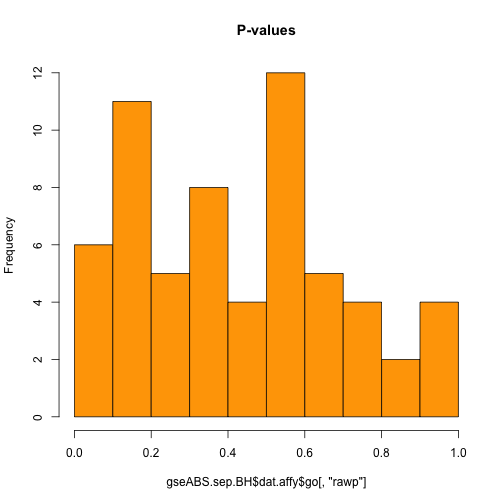

__Author: Nitesh Turaga, May 6th 2014__


Goal: Gene Set Analysis
========================================================

### Some Basics

Getting  the working directory, in my case


```r
getwd()
```

```
## [1] "/Users/niteshturaga/Documents/GeneExpressionDataAnalysis/GeneSetAnalysis"
```


Setting the working directory, in my case:

```r
setwd("~/Documents/GeneExpressionDataAnalysis/GeneSetAnalysis/")
```


Check the date


```r
date()
```

```
## [1] "Mon May  5 17:22:19 2014"
```


Clear the workspace, note the two "embedded" functions

```r
rm(list = ls())
```


Bioconductor
-------------

The following R packages were used to perform our analyses 

1. **BiocGenerics**: this library implements several generic classes and methods to work with {\Bioc} packages and can be obtained from Bioconductor.

2. **Biobase**: this library implements classes and methods to work with genomic data and can be obtained from {\Bioc};

3. **limma**: this library provide advanced methods to perform gene expression analysis from raw data to gene set analysis and can be obtained from Bioconductor.

4. **RTopper**: this library implements methods to perform integrated gene set analysis across datasets and platforms and can be obtained from Bioconductor.

5. **multtest**: this library implements methods to perform multiple test correction and can be obtained from Bioconductor.

6. **org.Hs.eg.db**: this library contains human genes annotation and can be obtained from Bioconductor.

7. **KEGG.db**: this library contains KEGG pathway annotation and can be obtained from Bioconductor.

8. **reactome.db**: this library contains Reactome pathway annotation and can be obtained from Bioconductor.

9. **GO.db**: this library contains Gene Ontoogy annotation and can be obtained from Bioconductor.

10. **AnnotationDBI** and **annotate**: these libraries contain classes and methods to access and manipulated annotation packages and can be obtained from Bioconductor.


Source the biocLite.R script from Bioconductor


```r
source("http://bioconductor.org/biocLite.R")
```

```
## Bioconductor version 2.13 (BiocInstaller 1.12.1), ?biocLite for help
## A newer version of Bioconductor is available after installing a new
##   version of R, ?BiocUpgrade for help
```

```r
### Get the list of available packages
installedPckgs <- installed.packages()[, "Package"]
### Define the list of desired libraries
pckgListBIOC <- c("BiocGenerics", "Biobase", "limma", "RTopper", "org.Hs.eg.db", 
    "AnnotationDbi", "annotate", "multtest", "KEGG.db", "GO.db")
### Load the packages, install them from Bioconductor if needed
for (pckg in pckgListBIOC) {
    if (!pckg %in% installedPckgs) {
        biocLite(pckg, suppressUpdates = TRUE, ask = FALSE)
    }
    require(pckg, character.only = TRUE)
}
```

```
## Loading required package: BiocGenerics
## Loading required package: parallel
## 
## Attaching package: 'BiocGenerics'
## 
## The following objects are masked from 'package:parallel':
## 
##     clusterApply, clusterApplyLB, clusterCall, clusterEvalQ,
##     clusterExport, clusterMap, parApply, parCapply, parLapply,
##     parLapplyLB, parRapply, parSapply, parSapplyLB
## 
## The following object is masked from 'package:stats':
## 
##     xtabs
## 
## The following objects are masked from 'package:base':
## 
##     anyDuplicated, append, as.data.frame, as.vector, cbind,
##     colnames, duplicated, eval, evalq, Filter, Find, get,
##     intersect, is.unsorted, lapply, Map, mapply, match, mget,
##     order, paste, pmax, pmax.int, pmin, pmin.int, Position, rank,
##     rbind, Reduce, rep.int, rownames, sapply, setdiff, sort,
##     table, tapply, union, unique, unlist
## 
## Loading required package: Biobase
## Welcome to Bioconductor
## 
##     Vignettes contain introductory material; view with
##     'browseVignettes()'. To cite Bioconductor, see
##     'citation("Biobase")', and for packages 'citation("pkgname")'.
## 
## Loading required package: limma
## 
## Attaching package: 'limma'
## 
## The following object is masked from 'package:BiocGenerics':
## 
##     plotMA
## 
## Loading required package: RTopper
## Loading required package: org.Hs.eg.db
## Loading required package: AnnotationDbi
## Loading required package: DBI
## 
## Loading required package: annotate
## Loading required package: multtest
## Loading required package: KEGG.db
## 
## KEGG.db contains mappings based on older data because the original
##   resource was removed from the the public domain before the most
##   recent update was produced. This package should now be
##   considered deprecated and future versions of Bioconductor may
##   not have it available.  Users who want more current data are
##   encouraged to look at the KEGGREST or reactome.db packages
## 
## Loading required package: GO.db
```


### code chunk number 3: Load Data and packages required

```r
require(RTopper)
data(sepScores)
ls()
```

```
## [1] "installedPckgs" "pckg"           "pckgListBIOC"   "sepScores"
```

```r
class(sepScores)
```

```
## [1] "list"
```

```r
names(sepScores)
```

```
## [1] "dat.affy"       "dat.agilent"    "dat.cnvHarvard" "dat.cnvMskcc"
```

```r
sapply(sepScores, class)
```

```
##       dat.affy    dat.agilent dat.cnvHarvard   dat.cnvMskcc 
##      "numeric"      "numeric"      "numeric"      "numeric"
```

```r
sapply(sepScores, dim)
```

```
## $dat.affy
## NULL
## 
## $dat.agilent
## NULL
## 
## $dat.cnvHarvard
## NULL
## 
## $dat.cnvMskcc
## NULL
```


### code chunk number 4: metaData

```r
require(org.Hs.eg.db)
org.Hs.eg()
```

```
## Quality control information for org.Hs.eg:
## 
## 
## This package has the following mappings:
## 
## org.Hs.egACCNUM has 31277 mapped keys (of 46265 keys)
## org.Hs.egACCNUM2EG has 629908 mapped keys (of 629908 keys)
## org.Hs.egALIAS2EG has 99696 mapped keys (of 99696 keys)
## org.Hs.egCHR has 45772 mapped keys (of 46265 keys)
## org.Hs.egCHRLENGTHS has 93 mapped keys (of 93 keys)
## org.Hs.egCHRLOC has 23648 mapped keys (of 46265 keys)
## org.Hs.egCHRLOCEND has 23648 mapped keys (of 46265 keys)
## org.Hs.egENSEMBL has 25125 mapped keys (of 46265 keys)
## org.Hs.egENSEMBL2EG has 27388 mapped keys (of 27388 keys)
## org.Hs.egENSEMBLPROT has 19731 mapped keys (of 46265 keys)
## org.Hs.egENSEMBLPROT2EG has 101504 mapped keys (of 101504 keys)
## org.Hs.egENSEMBLTRANS has 21903 mapped keys (of 46265 keys)
## org.Hs.egENSEMBLTRANS2EG has 164611 mapped keys (of 164611 keys)
## org.Hs.egENZYME has 2230 mapped keys (of 46265 keys)
## org.Hs.egENZYME2EG has 975 mapped keys (of 975 keys)
## org.Hs.egGENENAME has 46265 mapped keys (of 46265 keys)
## org.Hs.egGO has 18105 mapped keys (of 46265 keys)
## org.Hs.egGO2ALLEGS has 17608 mapped keys (of 17608 keys)
## org.Hs.egGO2EG has 13737 mapped keys (of 13737 keys)
## org.Hs.egMAP has 34976 mapped keys (of 46265 keys)
## org.Hs.egMAP2EG has 2498 mapped keys (of 2498 keys)
## org.Hs.egOMIM has 15648 mapped keys (of 46265 keys)
## org.Hs.egOMIM2EG has 19401 mapped keys (of 19401 keys)
## org.Hs.egPATH has 5870 mapped keys (of 46265 keys)
## org.Hs.egPATH2EG has 229 mapped keys (of 229 keys)
## org.Hs.egPFAM has 19052 mapped keys (of 46265 keys)
## org.Hs.egPMID has 31534 mapped keys (of 46265 keys)
## org.Hs.egPMID2EG has 394407 mapped keys (of 394407 keys)
## org.Hs.egPROSITE has 19052 mapped keys (of 46265 keys)
## org.Hs.egREFSEQ has 30052 mapped keys (of 46265 keys)
## org.Hs.egREFSEQ2EG has 167407 mapped keys (of 167407 keys)
## org.Hs.egSYMBOL has 46265 mapped keys (of 46265 keys)
## org.Hs.egSYMBOL2EG has 46257 mapped keys (of 46257 keys)
## org.Hs.egUCSCKG has 22914 mapped keys (of 46265 keys)
## org.Hs.egUNIGENE has 24059 mapped keys (of 46265 keys)
## org.Hs.egUNIGENE2EG has 25484 mapped keys (of 25484 keys)
## org.Hs.egUNIPROT has 19092 mapped keys (of 46265 keys)
## 
## 
## Additional Information about this package:
## 
## DB schema: HUMAN_DB
## DB schema version: 2.1
## Organism: Homo sapiens
## Date for NCBI data: 2013-Sep12
## Date for GO data: 20130907
## Date for KEGG data: 2011-Mar15
## Date for Golden Path data: 2010-Mar22
## Date for Ensembl data: 2013-Sep3
```


### code chunk number 5: list FGS (Functional Gene Set)

```r
kegg <- as.list(org.Hs.egPATH2EG)
length(kegg)
```

```
## [1] 229
```

```r
str(kegg[1:5])
```

```
## List of 5
##  $ 04610: chr [1:69] "2" "462" "623" "624" ...
##  $ 00232: chr [1:7] "9" "10" "1544" "1548" ...
##  $ 00983: chr [1:52] "9" "10" "978" "1066" ...
##  $ 01100: chr [1:1130] "9" "10" "15" "18" ...
##  $ 00380: chr [1:42] "15" "26" "38" "39" ...
```

```r
names(kegg)[1:5]
```

```
## [1] "04610" "00232" "00983" "01100" "00380"
```

```r
go <- as.list(org.Hs.egGO2ALLEGS)
length(go)
```

```
## [1] 17608
```

```r
str(go[1:5])
```

```
## List of 5
##  $ GO:0000002: Named chr [1:20] "291" "1763" "1890" "3980" ...
##   ..- attr(*, "names")= chr [1:20] "TAS" "IDA" "TAS" "IEA" ...
##  $ GO:0000003: Named chr [1:1328] "18" "49" "49" "49" ...
##   ..- attr(*, "names")= chr [1:1328] "IEA" "IEA" "IMP" "ISS" ...
##  $ GO:0000012: Named chr [1:9] "3981" "7141" "7515" "23411" ...
##   ..- attr(*, "names")= chr [1:9] "IDA" "IDA" "IEA" "IMP" ...
##  $ GO:0000018: Named chr [1:52] "604" "641" "641" "940" ...
##   ..- attr(*, "names")= chr [1:52] "IEA" "IEA" "IMP" "IEA" ...
##  $ GO:0000019: Named chr [1:4] "641" "4292" "4361" "10111"
##   ..- attr(*, "names")= chr [1:4] "IEA" "IEA" "TAS" "IDA"
```

```r
names(go)[1:5]
```

```
## [1] "GO:0000002" "GO:0000003" "GO:0000012" "GO:0000018" "GO:0000019"
```


### code chunk number 6: convertIDs

```r
numberOfFGSkegg <- 200
kegg <- lapply(kegg[sample(1:length(kegg), numberOfFGSkegg)], function(x) unique(unlist(mget(x, 
    org.Hs.egSYMBOL))))
str(kegg[1:5])
```

```
## List of 5
##  $ 00140: chr [1:56] "STS" "AKR1C4" "COMT" "CYP1A1" ...
##  $ 00340: chr [1:29] "AOC1" "ALDH2" "ALDH3A1" "ALDH1B1" ...
##  $ 00650: chr [1:30] "ABAT" "ACADS" "ACAT1" "ACAT2" ...
##  $ 05142: chr [1:104] "ADCY1" "AKT1" "AKT2" "FAS" ...
##  $ 00640: chr [1:32] "ABAT" "ACACA" "ACACB" "ACADM" ...
```

```r
### Process GO: keep only Biological Process
length(go)
```

```
## [1] 17608
```

```r
go <- go[Ontology(names(go)) == "BP"]
length(go)
```

```
## [1] 12288
```

```r
numberOfFGSgo <- 200
go <- lapply(go[sample(1:length(go), numberOfFGSgo)], function(x) unique(unlist(mget(x, 
    org.Hs.egSYMBOL))))
str(go[1:5])
```

```
## List of 5
##  $ GO:0034970: chr [1:2] "CARM1" "PRMT6"
##  $ GO:2001236: chr [1:90] "ACVR1" "AGT" "AGTR2" "AKT1" ...
##  $ GO:0021568: chr [1:2] "GBX2" "HOXA2"
##  $ GO:1902230: chr [1:22] "BCL2L1" "CD44" "CD74" "CDKN2D" ...
##  $ GO:0048102: chr [1:6] "BNIP3" "CDKN1B" "CDKN2D" "CTSV" ...
```


### code chunk number 7: annotateFGS

```r
require(KEGG.db)
KEGG()
```

```
## Quality control information for KEGG:
## 
## 
## This package has the following mappings:
## 
## KEGGENZYMEID2GO has 3999 mapped keys (of 3999 keys)
## KEGGEXTID2PATHID has 75100 mapped keys (of 75100 keys)
## KEGGGO2ENZYMEID has 4129 mapped keys (of 4129 keys)
## KEGGPATHID2EXTID has 3152 mapped keys (of 3152 keys)
## KEGGPATHID2NAME has 390 mapped keys (of 390 keys)
## KEGGPATHNAME2ID has 390 mapped keys (of 390 keys)
## 
## 
## Additional Information about this package:
## 
## DB schema: KEGG_DB
## DB schema version: 2.1
## Date for KEGG data: 2011-Mar15
```

```r
names(kegg) <- paste(names(kegg), unlist(mget(names(kegg), KEGGPATHID2NAME)), 
    sep = ".")
head(names(kegg), n = 10)
```

```
##  [1] "00140.Steroid hormone biosynthesis"             
##  [2] "00340.Histidine metabolism"                     
##  [3] "00650.Butanoate metabolism"                     
##  [4] "05142.Chagas disease (American trypanosomiasis)"
##  [5] "00640.Propanoate metabolism"                    
##  [6] "04115.p53 signaling pathway"                    
##  [7] "00260.Glycine, serine and threonine metabolism" 
##  [8] "04916.Melanogenesis"                            
##  [9] "00450.Selenocompound metabolism"                
## [10] "04150.mTOR signaling pathway"
```


### code chunk number 8: listFGS

```r
require(GO.db)
GO()
```

```
## Quality control information for GO:
## 
## 
## This package has the following mappings:
## 
## GOBPANCESTOR has 25193 mapped keys (of 25193 keys)
## GOBPCHILDREN has 14497 mapped keys (of 25193 keys)
## GOBPOFFSPRING has 14497 mapped keys (of 25193 keys)
## GOBPPARENTS has 25193 mapped keys (of 25193 keys)
## GOCCANCESTOR has 3232 mapped keys (of 3232 keys)
## GOCCCHILDREN has 1070 mapped keys (of 3232 keys)
## GOCCOFFSPRING has 1070 mapped keys (of 3232 keys)
## GOCCPARENTS has 3232 mapped keys (of 3232 keys)
## GOMFANCESTOR has 9602 mapped keys (of 9602 keys)
## GOMFCHILDREN has 1930 mapped keys (of 9602 keys)
## GOMFOFFSPRING has 1930 mapped keys (of 9602 keys)
## GOMFPARENTS has 9602 mapped keys (of 9602 keys)
## GOOBSOLETE has 1838 mapped keys (of 1838 keys)
## GOTERM has 38028 mapped keys (of 38028 keys)
## 
## 
## Additional Information about this package:
## 
## DB schema: GO_DB
## DB schema version: 2.1
## Date for GO data: 20130907
```

```r
names(go) <- paste(names(go), Term(names(go)), sep = ".")
head(names(go), n = 10)
```

```
##  [1] "GO:0034970.histone H3-R2 methylation"                                                             
##  [2] "GO:2001236.regulation of extrinsic apoptotic signaling pathway"                                   
##  [3] "GO:0021568.rhombomere 2 development"                                                              
##  [4] "GO:1902230.negative regulation of intrinsic apoptotic signaling pathway in response to DNA damage"
##  [5] "GO:0048102.autophagic cell death"                                                                 
##  [6] "GO:0006043.glucosamine catabolic process"                                                         
##  [7] "GO:0072272.proximal/distal pattern formation involved in metanephric nephron development"         
##  [8] "GO:0006270.DNA replication initiation"                                                            
##  [9] "GO:0046130.purine ribonucleoside catabolic process"                                               
## [10] "GO:0051933.amino acid uptake involved in synaptic transmission"
```


### code chunk number 9: listFGS

```r
fgsList <- list(go = go, kegg = kegg)
str(fgsList$go[1:5])
```

```
## List of 5
##  $ GO:0034970.histone H3-R2 methylation                                                             : chr [1:2] "CARM1" "PRMT6"
##  $ GO:2001236.regulation of extrinsic apoptotic signaling pathway                                   : chr [1:90] "ACVR1" "AGT" "AGTR2" "AKT1" ...
##  $ GO:0021568.rhombomere 2 development                                                              : chr [1:2] "GBX2" "HOXA2"
##  $ GO:1902230.negative regulation of intrinsic apoptotic signaling pathway in response to DNA damage: chr [1:22] "BCL2L1" "CD44" "CD74" "CDKN2D" ...
##  $ GO:0048102.autophagic cell death                                                                 : chr [1:6] "BNIP3" "CDKN1B" "CDKN2D" "CTSV" ...
```

```r
str(fgsList$kegg[1:5])
```

```
## List of 5
##  $ 00140.Steroid hormone biosynthesis             : chr [1:56] "STS" "AKR1C4" "COMT" "CYP1A1" ...
##  $ 00340.Histidine metabolism                     : chr [1:29] "AOC1" "ALDH2" "ALDH3A1" "ALDH1B1" ...
##  $ 00650.Butanoate metabolism                     : chr [1:30] "ABAT" "ACADS" "ACAT1" "ACAT2" ...
##  $ 05142.Chagas disease (American trypanosomiasis): chr [1:104] "ADCY1" "AKT1" "AKT2" "FAS" ...
##  $ 00640.Propanoate metabolism                    : chr [1:32] "ABAT" "ACACA" "ACACB" "ACADM" ...
```


### code chunk number 10: runGSEbatchArgs

```r
args(runBatchGSE)
```

```
## function (dataList, fgsList, ...) 
## NULL
```


### code chunk number 11: runBatchGSE.separate

```r
gseABS.sep <- runBatchGSE(dataList = sepScores, fgsList = fgsList)
gseABS.sep <- runBatchGSE(dataList = sepScores, fgsList = fgsList, absolute = TRUE, 
    type = "f", alternative = "mixed")
```


### code chunk number 12: runBatchGSE.separate2

```r
gseUP.sep <- runBatchGSE(dataList = sepScores, fgsList = fgsList, absolute = FALSE, 
    type = "t", alternative = "up")
gseDW.sep <- runBatchGSE(dataList = sepScores, fgsList = fgsList, absolute = FALSE, 
    type = "t", alternative = "down")
gseBOTH.sep <- runBatchGSE(dataList = sepScores, fgsList = fgsList, absolute = FALSE, 
    type = "t", alternative = "either")
```


### code chunk number 13: runBatchGSE.int3

```r
gseABSsim.sep <- runBatchGSE(dataList = sepScores, fgsList = fgsList, absolute = TRUE, 
    type = "f", alternative = "mixed", ranks.only = FALSE, nsim = 1000)
gseUPsim.sep <- runBatchGSE(dataList = sepScores, fgsList = fgsList, absolute = FALSE, 
    type = "t", alternative = "up", ranks.only = FALSE, nsim = 1000)
```


### code chunk number 14: runBatchGSE.format1

```r
str(gseUP.sep[1:5])
```

```
## List of 5
##  $ dat.affy      :List of 2
##   ..$ go  : Named num [1:200] NA 0.0527 NA NA NA ...
##   .. ..- attr(*, "names")= chr [1:200] "GO:0034970.histone H3-R2 methylation" "GO:2001236.regulation of extrinsic apoptotic signaling pathway" "GO:0021568.rhombomere 2 development" "GO:1902230.negative regulation of intrinsic apoptotic signaling pathway in response to DNA damage" ...
##   ..$ kegg: Named num [1:200] 0.318 0.835 0.114 0.197 0.87 ...
##   .. ..- attr(*, "names")= chr [1:200] "00140.Steroid hormone biosynthesis" "00340.Histidine metabolism" "00650.Butanoate metabolism" "05142.Chagas disease (American trypanosomiasis)" ...
##  $ dat.agilent   :List of 2
##   ..$ go  : Named num [1:200] NA 0.312 NA NA NA ...
##   .. ..- attr(*, "names")= chr [1:200] "GO:0034970.histone H3-R2 methylation" "GO:2001236.regulation of extrinsic apoptotic signaling pathway" "GO:0021568.rhombomere 2 development" "GO:1902230.negative regulation of intrinsic apoptotic signaling pathway in response to DNA damage" ...
##   ..$ kegg: Named num [1:200] 0.8688 0.9598 0.188 0.0929 0.9838 ...
##   .. ..- attr(*, "names")= chr [1:200] "00140.Steroid hormone biosynthesis" "00340.Histidine metabolism" "00650.Butanoate metabolism" "05142.Chagas disease (American trypanosomiasis)" ...
##  $ dat.cnvHarvard:List of 2
##   ..$ go  : Named num [1:200] NA 0.601 NA NA NA ...
##   .. ..- attr(*, "names")= chr [1:200] "GO:0034970.histone H3-R2 methylation" "GO:2001236.regulation of extrinsic apoptotic signaling pathway" "GO:0021568.rhombomere 2 development" "GO:1902230.negative regulation of intrinsic apoptotic signaling pathway in response to DNA damage" ...
##   ..$ kegg: Named num [1:200] 0.12 0.25 0.552 0.114 0.602 ...
##   .. ..- attr(*, "names")= chr [1:200] "00140.Steroid hormone biosynthesis" "00340.Histidine metabolism" "00650.Butanoate metabolism" "05142.Chagas disease (American trypanosomiasis)" ...
##  $ dat.cnvMskcc  :List of 2
##   ..$ go  : Named num [1:200] NA 0.869 NA NA NA ...
##   .. ..- attr(*, "names")= chr [1:200] "GO:0034970.histone H3-R2 methylation" "GO:2001236.regulation of extrinsic apoptotic signaling pathway" "GO:0021568.rhombomere 2 development" "GO:1902230.negative regulation of intrinsic apoptotic signaling pathway in response to DNA damage" ...
##   ..$ kegg: Named num [1:200] 0.188 0.573 0.93 0.508 0.751 ...
##   .. ..- attr(*, "names")= chr [1:200] "00140.Steroid hormone biosynthesis" "00340.Histidine metabolism" "00650.Butanoate metabolism" "05142.Chagas disease (American trypanosomiasis)" ...
##  $ NA            : NULL
```

```r
head(gseABSsim.sep$dat.affy$go)
```

```
##                                                              GO:0034970.histone H3-R2 methylation 
##                                                                                                NA 
##                                    GO:2001236.regulation of extrinsic apoptotic signaling pathway 
##                                                                                             0.988 
##                                                               GO:0021568.rhombomere 2 development 
##                                                                                                NA 
## GO:1902230.negative regulation of intrinsic apoptotic signaling pathway in response to DNA damage 
##                                                                                                NA 
##                                                                  GO:0048102.autophagic cell death 
##                                                                                                NA 
##                                                          GO:0006043.glucosamine catabolic process 
##                                                                                                NA
```

```r
head(gseABSsim.sep$dat.affy$kegg)
```

```
##              00140.Steroid hormone biosynthesis 
##                                          0.5824 
##                      00340.Histidine metabolism 
##                                          0.2268 
##                      00650.Butanoate metabolism 
##                                          0.8981 
## 05142.Chagas disease (American trypanosomiasis) 
##                                          0.7842 
##                     00640.Propanoate metabolism 
##                                          0.2248 
##                     04115.p53 signaling pathway 
##                                          0.4296
```


### code chunk number 15: runBatchGSE.altFunc

```r
require(limma)
gseUP.sep.2 <- runBatchGSE(dataList = sepScores, fgsList = fgsList, absolute = FALSE, 
    gseFunc = wilcoxGST, alternative = "up")
```


### code chunk number 16: runBatchGSE.format2

```r
str(gseUP.sep.2)
```

```
## List of 4
##  $ dat.affy      :List of 2
##   ..$ go  : Named num [1:200] NA 0.0527 NA NA NA ...
##   .. ..- attr(*, "names")= chr [1:200] "GO:0034970.histone H3-R2 methylation" "GO:2001236.regulation of extrinsic apoptotic signaling pathway" "GO:0021568.rhombomere 2 development" "GO:1902230.negative regulation of intrinsic apoptotic signaling pathway in response to DNA damage" ...
##   ..$ kegg: Named num [1:200] 0.318 0.835 0.114 0.197 0.87 ...
##   .. ..- attr(*, "names")= chr [1:200] "00140.Steroid hormone biosynthesis" "00340.Histidine metabolism" "00650.Butanoate metabolism" "05142.Chagas disease (American trypanosomiasis)" ...
##  $ dat.agilent   :List of 2
##   ..$ go  : Named num [1:200] NA 0.312 NA NA NA ...
##   .. ..- attr(*, "names")= chr [1:200] "GO:0034970.histone H3-R2 methylation" "GO:2001236.regulation of extrinsic apoptotic signaling pathway" "GO:0021568.rhombomere 2 development" "GO:1902230.negative regulation of intrinsic apoptotic signaling pathway in response to DNA damage" ...
##   ..$ kegg: Named num [1:200] 0.8688 0.9598 0.188 0.0929 0.9838 ...
##   .. ..- attr(*, "names")= chr [1:200] "00140.Steroid hormone biosynthesis" "00340.Histidine metabolism" "00650.Butanoate metabolism" "05142.Chagas disease (American trypanosomiasis)" ...
##  $ dat.cnvHarvard:List of 2
##   ..$ go  : Named num [1:200] NA 0.601 NA NA NA ...
##   .. ..- attr(*, "names")= chr [1:200] "GO:0034970.histone H3-R2 methylation" "GO:2001236.regulation of extrinsic apoptotic signaling pathway" "GO:0021568.rhombomere 2 development" "GO:1902230.negative regulation of intrinsic apoptotic signaling pathway in response to DNA damage" ...
##   ..$ kegg: Named num [1:200] 0.12 0.25 0.552 0.114 0.602 ...
##   .. ..- attr(*, "names")= chr [1:200] "00140.Steroid hormone biosynthesis" "00340.Histidine metabolism" "00650.Butanoate metabolism" "05142.Chagas disease (American trypanosomiasis)" ...
##  $ dat.cnvMskcc  :List of 2
##   ..$ go  : Named num [1:200] NA 0.869 NA NA NA ...
##   .. ..- attr(*, "names")= chr [1:200] "GO:0034970.histone H3-R2 methylation" "GO:2001236.regulation of extrinsic apoptotic signaling pathway" "GO:0021568.rhombomere 2 development" "GO:1902230.negative regulation of intrinsic apoptotic signaling pathway in response to DNA damage" ...
##   ..$ kegg: Named num [1:200] 0.188 0.573 0.93 0.508 0.751 ...
##   .. ..- attr(*, "names")= chr [1:200] "00140.Steroid hormone biosynthesis" "00340.Histidine metabolism" "00650.Butanoate metabolism" "05142.Chagas disease (American trypanosomiasis)" ...
```

```r
all(gseUP.sep.2$go == gseUP.sep$go)
```

```
## [1] TRUE
```


### code chunk number 17: runBatchGSE.altFunc2

```r
gseFunc <- function(selected, statistics, threshold) {
    diffExpGenes <- statistics > threshold
    tab <- table(diffExpGenes, selected)
    pVal <- fisher.test(tab)[["p.value"]]
}
gseUP.sep.3 <- runBatchGSE(dataList = sepScores, fgsList = fgsList, absolute = FALSE, 
    gseFunc = gseFunc, threshold = 7.5)
```


### code chunk number 18: runBatchGSE.format3

```r
str(gseUP.sep.3)
```

```
## List of 4
##  $ dat.affy      :List of 2
##   ..$ go  : Named num [1:200] NA 1 NA NA NA NA NA NA 1 NA ...
##   .. ..- attr(*, "names")= chr [1:200] "GO:0034970.histone H3-R2 methylation" "GO:2001236.regulation of extrinsic apoptotic signaling pathway" "GO:0021568.rhombomere 2 development" "GO:1902230.negative regulation of intrinsic apoptotic signaling pathway in response to DNA damage" ...
##   ..$ kegg: Named num [1:200] 1 1 1 1 1 1 1 1 NA NA ...
##   .. ..- attr(*, "names")= chr [1:200] "00140.Steroid hormone biosynthesis" "00340.Histidine metabolism" "00650.Butanoate metabolism" "05142.Chagas disease (American trypanosomiasis)" ...
##  $ dat.agilent   :List of 2
##   ..$ go  : Named num [1:200] NA 1 NA NA NA NA NA NA 1 NA ...
##   .. ..- attr(*, "names")= chr [1:200] "GO:0034970.histone H3-R2 methylation" "GO:2001236.regulation of extrinsic apoptotic signaling pathway" "GO:0021568.rhombomere 2 development" "GO:1902230.negative regulation of intrinsic apoptotic signaling pathway in response to DNA damage" ...
##   ..$ kegg: Named num [1:200] 1 1 1 1 1 1 1 1 NA NA ...
##   .. ..- attr(*, "names")= chr [1:200] "00140.Steroid hormone biosynthesis" "00340.Histidine metabolism" "00650.Butanoate metabolism" "05142.Chagas disease (American trypanosomiasis)" ...
##  $ dat.cnvHarvard:List of 2
##   ..$ go  : Named num [1:200] NA 1 NA NA NA NA NA NA 1 NA ...
##   .. ..- attr(*, "names")= chr [1:200] "GO:0034970.histone H3-R2 methylation" "GO:2001236.regulation of extrinsic apoptotic signaling pathway" "GO:0021568.rhombomere 2 development" "GO:1902230.negative regulation of intrinsic apoptotic signaling pathway in response to DNA damage" ...
##   ..$ kegg: Named num [1:200] 1 1 1 1 1 1 1 1 NA NA ...
##   .. ..- attr(*, "names")= chr [1:200] "00140.Steroid hormone biosynthesis" "00340.Histidine metabolism" "00650.Butanoate metabolism" "05142.Chagas disease (American trypanosomiasis)" ...
##  $ dat.cnvMskcc  :List of 2
##   ..$ go  : Named num [1:200] NA 1 NA NA NA NA NA NA 1 NA ...
##   .. ..- attr(*, "names")= chr [1:200] "GO:0034970.histone H3-R2 methylation" "GO:2001236.regulation of extrinsic apoptotic signaling pathway" "GO:0021568.rhombomere 2 development" "GO:1902230.negative regulation of intrinsic apoptotic signaling pathway in response to DNA damage" ...
##   ..$ kegg: Named num [1:200] 1 1 1 1 1 1 1 1 NA NA ...
##   .. ..- attr(*, "names")= chr [1:200] "00140.Steroid hormone biosynthesis" "00340.Histidine metabolism" "00650.Butanoate metabolism" "05142.Chagas disease (American trypanosomiasis)" ...
```

```r
head(data.frame(fisher = gseUP.sep.3$dat.affy$kegg, wilcoxon = gseUP.sep$dat.affy$kegg))
```

```
##                                                 fisher wilcoxon
## 00140.Steroid hormone biosynthesis                   1   0.3180
## 00340.Histidine metabolism                           1   0.8348
## 00650.Butanoate metabolism                           1   0.1143
## 05142.Chagas disease (American trypanosomiasis)      1   0.1971
## 00640.Propanoate metabolism                          1   0.8698
## 04115.p53 signaling pathway                          1   0.6250
```


### code chunk number 19: adjustP

```r
gseABS.sep.BH <- adjustPvalGSE(gseABS.sep)
gseABS.sep.holm <- adjustPvalGSE(gseABS.sep, proc = "Holm")
```


### code chunk number 20: adjusted.format

```r
names(gseABS.sep.BH)
```

```
## [1] "dat.affy"       "dat.agilent"    "dat.cnvHarvard" "dat.cnvMskcc"
```

```r
names(gseABS.sep.holm)
```

```
## [1] "dat.affy"       "dat.agilent"    "dat.cnvHarvard" "dat.cnvMskcc"
```

```r
str(gseABS.sep.BH$dat.affy)
```

```
## List of 2
##  $ go  : num [1:200, 1:2] NA 0.979 NA NA NA ...
##   ..- attr(*, "dimnames")=List of 2
##   .. ..$ : chr [1:200] "GO:0034970.histone H3-R2 methylation" "GO:2001236.regulation of extrinsic apoptotic signaling pathway" "GO:0021568.rhombomere 2 development" "GO:1902230.negative regulation of intrinsic apoptotic signaling pathway in response to DNA damage" ...
##   .. ..$ : chr [1:2] "rawp" "BH"
##  $ kegg: num [1:200, 1:2] 0.723 0.191 0.912 0.829 0.152 ...
##   ..- attr(*, "dimnames")=List of 2
##   .. ..$ : chr [1:200] "00140.Steroid hormone biosynthesis" "00340.Histidine metabolism" "00650.Butanoate metabolism" "05142.Chagas disease (American trypanosomiasis)" ...
##   .. ..$ : chr [1:2] "rawp" "BH"
```

```r
str(gseABS.sep.holm$dat.affy)
```

```
## List of 2
##  $ go  : num [1:200, 1:2] NA 0.979 NA NA NA ...
##   ..- attr(*, "dimnames")=List of 2
##   .. ..$ : chr [1:200] "GO:0034970.histone H3-R2 methylation" "GO:2001236.regulation of extrinsic apoptotic signaling pathway" "GO:0021568.rhombomere 2 development" "GO:1902230.negative regulation of intrinsic apoptotic signaling pathway in response to DNA damage" ...
##   .. ..$ : chr [1:2] "rawp" "Holm"
##  $ kegg: num [1:200, 1:2] 0.723 0.191 0.912 0.829 0.152 ...
##   ..- attr(*, "dimnames")=List of 2
##   .. ..$ : chr [1:200] "00140.Steroid hormone biosynthesis" "00340.Histidine metabolism" "00650.Butanoate metabolism" "05142.Chagas disease (American trypanosomiasis)" ...
##   .. ..$ : chr [1:2] "rawp" "Holm"
```

```r
head(gseABS.sep.BH$dat.affy$go, n = 10)
```

```
##                                                                                                     rawp
## GO:0034970.histone H3-R2 methylation                                                                  NA
## GO:2001236.regulation of extrinsic apoptotic signaling pathway                                    0.9791
## GO:0021568.rhombomere 2 development                                                                   NA
## GO:1902230.negative regulation of intrinsic apoptotic signaling pathway in response to DNA damage     NA
## GO:0048102.autophagic cell death                                                                      NA
## GO:0006043.glucosamine catabolic process                                                              NA
## GO:0072272.proximal/distal pattern formation involved in metanephric nephron development              NA
## GO:0006270.DNA replication initiation                                                                 NA
## GO:0046130.purine ribonucleoside catabolic process                                                0.3239
## GO:0051933.amino acid uptake involved in synaptic transmission                                        NA
##                                                                                                   BH
## GO:0034970.histone H3-R2 methylation                                                              NA
## GO:2001236.regulation of extrinsic apoptotic signaling pathway                                     1
## GO:0021568.rhombomere 2 development                                                               NA
## GO:1902230.negative regulation of intrinsic apoptotic signaling pathway in response to DNA damage NA
## GO:0048102.autophagic cell death                                                                  NA
## GO:0006043.glucosamine catabolic process                                                          NA
## GO:0072272.proximal/distal pattern formation involved in metanephric nephron development          NA
## GO:0006270.DNA replication initiation                                                             NA
## GO:0046130.purine ribonucleoside catabolic process                                                 1
## GO:0051933.amino acid uptake involved in synaptic transmission                                    NA
```

```r
head(gseABS.sep.holm$dat.affy$go, n = 10)
```

```
##                                                                                                     rawp
## GO:0034970.histone H3-R2 methylation                                                                  NA
## GO:2001236.regulation of extrinsic apoptotic signaling pathway                                    0.9791
## GO:0021568.rhombomere 2 development                                                                   NA
## GO:1902230.negative regulation of intrinsic apoptotic signaling pathway in response to DNA damage     NA
## GO:0048102.autophagic cell death                                                                      NA
## GO:0006043.glucosamine catabolic process                                                              NA
## GO:0072272.proximal/distal pattern formation involved in metanephric nephron development              NA
## GO:0006270.DNA replication initiation                                                                 NA
## GO:0046130.purine ribonucleoside catabolic process                                                0.3239
## GO:0051933.amino acid uptake involved in synaptic transmission                                        NA
##                                                                                                   Holm
## GO:0034970.histone H3-R2 methylation                                                                NA
## GO:2001236.regulation of extrinsic apoptotic signaling pathway                                       1
## GO:0021568.rhombomere 2 development                                                                 NA
## GO:1902230.negative regulation of intrinsic apoptotic signaling pathway in response to DNA damage   NA
## GO:0048102.autophagic cell death                                                                    NA
## GO:0006043.glucosamine catabolic process                                                            NA
## GO:0072272.proximal/distal pattern formation involved in metanephric nephron development            NA
## GO:0006270.DNA replication initiation                                                               NA
## GO:0046130.purine ribonucleoside catabolic process                                                   1
## GO:0051933.amino acid uptake involved in synaptic transmission                                      NA
```


### code chunk number 21: figure004

```r
hist(gseABS.sep.BH$dat.affy$go[, "rawp"], nclass = 10, col = "orange", main = "P-values")
```

 


### code chunk number 22: figure005

```r
hist(gseABS.sep.BH$dat.affy$go[, "BH"], nclass = 10, col = "orange", main = "Q-values")
```

 


### code chunk number 23: readAndProcessData

```r
autismGenes <- read.table("myData/101symbols_v02.txt", sep = "\t", header = TRUE, 
    colClasses = "character")
str(autismGenes)
```

```
## 'data.frame':	101 obs. of  1 variable:
##  $ SYMBOL: chr  "ANKRD11" "AP1S2" "ARX" "ATRX" ...
```


### code chunk number 24: newFunctionForLists

```r
formatGeneList <- function(geneList, allGenes) {
    stats <- 1 * allGenes %in% geneList
    names(stats) <- allGenes
    out <- list(GeneList = stats)
}
```


### code chunk number 25: formatTheGeneLsit

```r
allGenes <- unique(unlist(as.list(org.Hs.egSYMBOL)))
str(allGenes)
```

```
##  chr [1:46257] "A1BG" "NAT2" "ADA" "CDH2" "AKT3" "GAGE12F" ...
```

```r
geneMembership <- formatGeneList(autismGenes$SYMBOL, allGenes)
str(geneMembership)
```

```
## List of 1
##  $ GeneList: Named num [1:46257] 0 0 0 0 0 0 0 0 0 0 ...
##   ..- attr(*, "names")= chr [1:46257] "A1BG" "NAT2" "ADA" "CDH2" ...
```

```r
table(geneMembership$GeneList)
```

```
## 
##     0     1 
## 46156   101
```


### code chunk number 26: runBatchGSE.altFunc3

```r
gseMyList <- runBatchGSE(dataList = geneMembership, fgsList = fgsList, absolute = FALSE, 
    gseFunc = gseFunc, threshold = 0.5)
```


### code chunk number 27: showTheResults

```r
str(gseMyList)
```

```
## List of 1
##  $ GeneList:List of 2
##   ..$ go  : Named num [1:200] 1 1 1 1 1 ...
##   .. ..- attr(*, "names")= chr [1:200] "GO:0034970.histone H3-R2 methylation" "GO:2001236.regulation of extrinsic apoptotic signaling pathway" "GO:0021568.rhombomere 2 development" "GO:1902230.negative regulation of intrinsic apoptotic signaling pathway in response to DNA damage" ...
##   ..$ kegg: Named num [1:200] 1 1 1 0.204 1 ...
##   .. ..- attr(*, "names")= chr [1:200] "00140.Steroid hormone biosynthesis" "00340.Histidine metabolism" "00650.Butanoate metabolism" "05142.Chagas disease (American trypanosomiasis)" ...
```

```r
str(gseMyList$GeneList$kegg)
```

```
##  Named num [1:200] 1 1 1 0.204 1 ...
##  - attr(*, "names")= chr [1:200] "00140.Steroid hormone biosynthesis" "00340.Histidine metabolism" "00650.Butanoate metabolism" "05142.Chagas disease (American trypanosomiasis)" ...
```

```r
summary(gseMyList$GeneList$kegg)
```

```
##    Min. 1st Qu.  Median    Mean 3rd Qu.    Max. 
##   0.000   0.142   1.000   0.691   1.000   1.000
```

```r
table(is.na(gseMyList$GeneList$kegg))
```

```
## 
## FALSE 
##   200
```

```r
table(gseMyList$GeneList$kegg < 0.01)
```

```
## 
## FALSE  TRUE 
##   182    18
```

```r
table(gseMyList$GeneList$go < 0.01)
```

```
## 
## FALSE  TRUE 
##   176    24
```


### code chunk number 28: adjustP.2

```r
gseMyList.BH <- adjustPvalGSE(gseMyList)
gseMyList.BH$GeneList$go[gseMyList.BH$GeneList$go[, "BH"] < 0.01, ]
```

```
##                                                                rawp
## GO:0046130.purine ribonucleoside catabolic process        3.529e-04
## GO:2000648.positive regulation of stem cell proliferation 2.713e-04
## GO:0007420.brain development                              2.179e-23
## GO:0021542.dentate gyrus development                      4.865e-04
## GO:0021604.cranial nerve structural organization          9.842e-05
## GO:0006950.response to stress                             1.172e-08
## GO:0016331.morphogenesis of embryonic epithelium          2.759e-04
## GO:0070271.protein complex biogenesis                     6.436e-04
## GO:0050803.regulation of synapse structure and activity   4.068e-11
## GO:0042692.muscle cell differentiation                    1.134e-04
## GO:0022607.cellular component assembly                    1.578e-12
## GO:0048703.embryonic viscerocranium morphogenesis         2.100e-04
## GO:0048701.embryonic cranial skeleton morphogenesis       8.062e-05
## GO:0048519.negative regulation of biological process      3.953e-14
## GO:0006195.purine nucleotide catabolic process            8.977e-05
## GO:1990138.neuron projection extension                    5.184e-04
##                                                                  BH
## GO:0046130.purine ribonucleoside catabolic process        5.429e-03
## GO:2000648.positive regulation of stem cell proliferation 4.598e-03
## GO:0007420.brain development                              4.358e-21
## GO:0021542.dentate gyrus development                      6.912e-03
## GO:0021604.cranial nerve structural organization          2.461e-03
## GO:0006950.response to stress                             4.688e-07
## GO:0016331.morphogenesis of embryonic epithelium          4.598e-03
## GO:0070271.protein complex biogenesis                     8.045e-03
## GO:0050803.regulation of synapse structure and activity   2.034e-09
## GO:0042692.muscle cell differentiation                    2.519e-03
## GO:0022607.cellular component assembly                    1.052e-10
## GO:0048703.embryonic viscerocranium morphogenesis         4.200e-03
## GO:0048701.embryonic cranial skeleton morphogenesis       2.461e-03
## GO:0048519.negative regulation of biological process      3.953e-12
## GO:0006195.purine nucleotide catabolic process            2.461e-03
## GO:1990138.neuron projection extension                    6.912e-03
```

```r
gseMyList.BH$GeneList$kegg[gseMyList.BH$GeneList$kegg[, "BH"] < 0.01, ]
```

```
##                                           rawp        BH
## 04514.Cell adhesion molecules (CAMs) 5.109e-07 0.0001022
## 04510.Focal adhesion                 8.130e-05 0.0054202
## 05211.Renal cell carcinoma           1.757e-05 0.0017571
```


### code chunk number 29: sessioInfo

```r
sessionInfo()
```

```
## R version 3.0.3 (2014-03-06)
## Platform: x86_64-apple-darwin13.1.0 (64-bit)
## 
## locale:
## [1] en_US.UTF-8/en_US.UTF-8/en_US.UTF-8/C/en_US.UTF-8/en_US.UTF-8
## 
## attached base packages:
## [1] parallel  stats     graphics  grDevices utils     datasets  methods  
## [8] base     
## 
## other attached packages:
##  [1] GO.db_2.10.1         KEGG.db_2.10.1       multtest_2.18.0     
##  [4] annotate_1.40.1      org.Hs.eg.db_2.10.1  RSQLite_0.11.4      
##  [7] DBI_0.2-7            AnnotationDbi_1.24.0 RTopper_1.8.0       
## [10] limma_3.18.13        Biobase_2.22.0       BiocGenerics_0.8.0  
## [13] BiocInstaller_1.12.1 knitr_1.5           
## 
## loaded via a namespace (and not attached):
##  [1] evaluate_0.5.5  formatR_0.10    IRanges_1.20.7  MASS_7.3-33    
##  [5] splines_3.0.3   stats4_3.0.3    stringr_0.6.2   survival_2.37-7
##  [9] tools_3.0.3     XML_3.98-1.1    xtable_1.7-3
```


