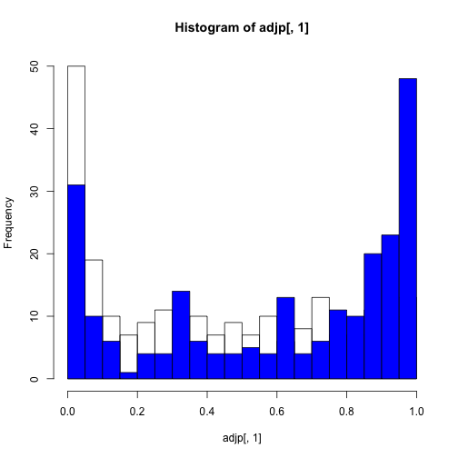

__Author: Luigi Marchionni, May 6th 2014__

Goal: from Affymetrix raw data stored in CEL files to differential gene expression
========================================================

### Some Basics

Getting  the working directory, in my case


```r
getwd()
```

```
## [1] "/Users/niteshturaga/Documents/GeneExpressionDataAnalysis/affyData"
```


Setting the working directory, in my case:

```r
setwd("~/Documents/GeneExpressionDataAnalysis/affyData/")
```


Check the date


```r
date()
```

```
## [1] "Mon May  5 10:33:27 2014"
```


Clear the workspace, note the two "embedded" functions

```r
rm(list = ls())
```


Bioconductor
--------------
We are going to use the following packages from bioconductor:

1. affy 
2. limma 
3. hgu95a.db
4. annotate

### Load the libraries needed for the analysis,


```r
require(affy)
```

```
## Loading required package: affy
## Loading required package: BiocGenerics
## Loading required package: parallel
## 
## Attaching package: 'BiocGenerics'
## 
## The following objects are masked from 'package:parallel':
## 
##     clusterApply, clusterApplyLB, clusterCall, clusterEvalQ,
##     clusterExport, clusterMap, parApply, parCapply, parLapply,
##     parLapplyLB, parRapply, parSapply, parSapplyLB
## 
## The following object is masked from 'package:stats':
## 
##     xtabs
## 
## The following objects are masked from 'package:base':
## 
##     anyDuplicated, append, as.data.frame, as.vector, cbind,
##     colnames, duplicated, eval, evalq, Filter, Find, get,
##     intersect, is.unsorted, lapply, Map, mapply, match, mget,
##     order, paste, pmax, pmax.int, pmin, pmin.int, Position, rank,
##     rbind, Reduce, rep.int, rownames, sapply, setdiff, sort,
##     table, tapply, union, unique, unlist
## 
## Loading required package: Biobase
## Welcome to Bioconductor
## 
##     Vignettes contain introductory material; view with
##     'browseVignettes()'. To cite Bioconductor, see
##     'citation("Biobase")', and for packages 'citation("pkgname")'.
```

```r
require(limma)
```

```
## Loading required package: limma
## 
## Attaching package: 'limma'
## 
## The following object is masked from 'package:BiocGenerics':
## 
##     plotMA
```

```r
require(hgu95a.db)
```

```
## Loading required package: hgu95a.db
## Loading required package: AnnotationDbi
## Loading required package: org.Hs.eg.db
## Loading required package: DBI
```

```r
require(annotate)
```

```
## Loading required package: annotate
```


### Load  data previously stored

```r
# Gene expression data
load("./objs/affyData.rda")

# Load linear model results
load("./objs/linearModel.rda")
```


Create Functional Gene Set
---------------------------

Lets create the Functional Gene Set (FGS) list. We will get the data from the annotation
medata package **hgu95a.db** . Use the package name as a function for listing the annotation content


```r
hgu95a()
```

```
## Quality control information for hgu95a:
## 
## 
## This package has the following mappings:
## 
## hgu95aACCNUM has 12626 mapped keys (of 12626 keys)
## hgu95aALIAS2PROBE has 33149 mapped keys (of 99696 keys)
## hgu95aCHR has 11559 mapped keys (of 12626 keys)
## hgu95aCHRLENGTHS has 93 mapped keys (of 93 keys)
## hgu95aCHRLOC has 11493 mapped keys (of 12626 keys)
## hgu95aCHRLOCEND has 11493 mapped keys (of 12626 keys)
## hgu95aENSEMBL has 11455 mapped keys (of 12626 keys)
## hgu95aENSEMBL2PROBE has 9699 mapped keys (of 27388 keys)
## hgu95aENTREZID has 11562 mapped keys (of 12626 keys)
## hgu95aENZYME has 2121 mapped keys (of 12626 keys)
## hgu95aENZYME2PROBE has 786 mapped keys (of 975 keys)
## hgu95aGENENAME has 11562 mapped keys (of 12626 keys)
## hgu95aGO has 11241 mapped keys (of 12626 keys)
## hgu95aGO2ALLPROBES has 16108 mapped keys (of 17608 keys)
## hgu95aGO2PROBE has 12081 mapped keys (of 13737 keys)
## hgu95aMAP has 11535 mapped keys (of 12626 keys)
## hgu95aOMIM has 10474 mapped keys (of 12626 keys)
## hgu95aPATH has 5383 mapped keys (of 12626 keys)
## hgu95aPATH2PROBE has 228 mapped keys (of 229 keys)
## hgu95aPFAM has 11322 mapped keys (of 12626 keys)
## hgu95aPMID has 11548 mapped keys (of 12626 keys)
## hgu95aPMID2PROBE has 340884 mapped keys (of 394407 keys)
## hgu95aPROSITE has 11322 mapped keys (of 12626 keys)
## hgu95aREFSEQ has 11522 mapped keys (of 12626 keys)
## hgu95aSYMBOL has 11562 mapped keys (of 12626 keys)
## hgu95aUNIGENE has 11547 mapped keys (of 12626 keys)
## hgu95aUNIPROT has 11324 mapped keys (of 12626 keys)
## 
## 
## Additional Information about this package:
## 
## DB schema: HUMANCHIP_DB
## DB schema version: 2.1
## Organism: Homo sapiens
## Date for NCBI data: 2013-Sep12
## Date for GO data: 20130907
## Date for KEGG data: 2011-Mar15
## Date for Golden Path data: 2010-Mar22
## Date for Ensembl data: 2013-Sep3
```


Each environment in a metadata package maps identifiers to annotation information.
The annotation information can be gene/identifiers centered, or annotation centered.

Example: __"ID -> SYMBOL"__ is gene centered,
while __"PATHID -> genes"__ is annotation centered.
We need the second type of mapping: one FGS to all the genes of the FGS


### This extracts mapping between kegg and affy identifiers for this platform

```r
kegg <- as.list(hgu95aPATH2PROBE)
```


### This for GENE ONTOLOGY

```r
go <- as.list(hgu95aGO2ALLPROBES)
```


The code above created a list where each element has name
(the kegg identifiers) and contains a vector of identifiers, see below,

```r
class(kegg)
```

```
## [1] "list"
```

```r
length(kegg)
```

```
## [1] 229
```

```r
str(head(kegg))
```

```
## List of 6
##  $ 04610: chr [1:73] "37175_at" "33549_at" "39309_at" "39310_at" ...
##  $ 00232: chr [1:11] "38187_at" "38912_at" "1080_s_at" "1493_r_at" ...
##  $ 00983: chr [1:45] "38187_at" "38912_at" "1117_at" "1493_r_at" ...
##  $ 01100: chr [1:957] "38187_at" "38912_at" "36332_at" "33445_at" ...
##  $ 00380: chr [1:45] "36332_at" "37186_s_at" "39678_at" "34790_at" ...
##  $ 00970: chr [1:24] "36185_at" "40408_at" "32615_at" "35300_at" ...
```


Wilcoxon Rank-Sum Test
--------------------------

To run a Wilcoxon rank-sum test we can use the **geneSetTest()** function in limma
we need to identify the genes in the FGS, and give also a ranking statistics.
To this end we will use the t-statistics obtained using the topTable() function


The test on the fisrt FGS: default parameters

```r

geneSetTest(tG2$ID %in% kegg[[1]], tG2$t)
```

```
## [1] 0.9378
```


The test on the fisrt FGS: shift toward down-reguated genes

```r
geneSetTest(tG2$ID %in% kegg[[1]], tG2$t, alternative = "down")
```

```
## [1] 0.9999
```


The test on the fisrt FGS: shift toward up-reguated genes

```r
geneSetTest(tG2$ID %in% kegg[[1]], tG2$t, alternative = "up")
```

```
## [1] 0.0001044
```


### Visual representation


```r
barcodeplot(tG2$ID %in% kegg[[1]], tG2$t)
```

```
## Error: only 0's may be mixed with negative subscripts
```


### The test on all KEGG  FGS (after removing NA)

```r
kegg2 <- kegg[!is.na(kegg)]
gse <- vector()
for (i in 1:length(kegg2)) {
    gse[i] <- geneSetTest(tG2$ID %in% kegg2[[i]], tG2$t)
    names(gse)[i] <- names(kegg2)[i]
}

### This is an alternative
tmp <- sapply(kegg2, function(gs, stat, ids) {
    geneSetTest(ids %in% gs, stat)
}, stat = tG2$t, ids = tG2$ID)
```


### See the results

```r
str(gse)
```

```
##  Named num [1:228] 0.938 0.27 0.362 0.876 0.568 ...
##  - attr(*, "names")= chr [1:228] "04610" "00232" "00983" "01100" ...
```

```r
head(gse)
```

```
##   04610   00232   00983   01100   00380   00970 
## 0.93782 0.26954 0.36212 0.87648 0.56830 0.08388
```


### The test on all KEGG  FGS (we can also test for NA inside the loop)

```r
gse <- vector()
for (i in 1:length(kegg)) {
    # check if all values are NOT true
    if (all(!tG2$ID %in% kegg[[i]])) {
        gse[i] <- NA
    } else {
        gse[i] <- geneSetTest(tG2$ID %in% kegg[[i]], tG2$t)
    }
    names(gse)[i] <- names(kegg)[i]
}
```


### Check how the gse vector looks, the length and the structure

```r
length(gse)
```

```
## [1] 229
```

```r
str(gse)
```

```
##  Named num [1:229] 0.938 0.27 0.362 0.876 0.568 ...
##  - attr(*, "names")= chr [1:229] "04610" "00232" "00983" "01100" ...
```


### This is the way we can visualize this: the first gene set

```r
i = 10
barcodeplot(tG2$ID %in% kegg[[i]], tG2$t)
```

```
## Error: only 0's may be mixed with negative subscripts
```


### This is the way we can visualize this: the smallest pvalue

```r
i = which.min(gse)
barcodeplot(tG2$ID %in% kegg[[i]], tG2$t)
```

```
## Error: only 0's may be mixed with negative subscripts
```


### This is the way we can visualize this: the larest pvalue

```r
i = which.max(gse)
barcodeplot(tG2$ID %in% kegg[[i]], tG2$t)
```

```
## Error: only 0's may be mixed with negative subscripts
```


We can also use the geneSetTest() function differently,
you can learn about this function by typing

```r
`?`(geneSetTest)

# Or simply print the arguments of the function
args(geneSetTest)
```


### We can compare our FGS to randomly generated lists of genes
### of the same size of our FGS of interest and compute the p-value
### as the proportion of times our FGS returns a smaller p-value
### compared to the randomly generated lists

```r
geneSetTest(tG2$ID %in% kegg[[1]], tG2$t, alternative = "up", type = "t", ranks.only = FALSE, 
    nsim = 1000)
```

```
## [1] 0.001998
```

```r

geneSetTest(tG2$ID %in% kegg[[94]], tG2$t, alternative = "down", type = "t", 
    ranks.only = FALSE, nsim = 1000)
```

```
## [1] 0.5355
```


### limma enables you to run also self-contained tests as opposed to competitive tests
### To do this you can use the roast() function

### Extract the expression values

```r
mat <- exprs(dat.rma)
```

### Select gene expression for the genes in the FGS

```r
sel <- rownames(mat) %in% kegg[[1]]
```


### For this analysis the design matrix must already account for the contrasts

```r
newDmat <- data.frame(Intercept = 1, CellType = dMat2[, 1] + dMat2[, 2] + (-1 * 
    (dMat2[, 3] + dMat2[, 4])))
```


### Run the test on one FGS: the contrast is the column index from the design matrix

```r
roast(iset = sel, y = mat, design = newDmat, contrast = 2)
```

```
## Error: unused argument (iset = sel)
```


### The test on the first five FGS for KEGG

```r
gse2 <- list()
for (i in 1:5) {
    sel <- rownames(mat) %in% kegg[[i]]
    gse2[[i]] <- roast(sel, mat, design = newDmat, contrast = 2)
    names(gse2)[i] <- names(kegg)[i]
}
```

```
## Error: row dimension of design matrix must match column dimension of data
```


### The test on the first five FGS for GO

```r
gse.go <- list()
for (i in 1:5) {
    sel <- rownames(mat) %in% go[[i]]
    gse.go[[i]] <- roast(sel, mat, design = newDmat, contrast = 2)
    names(gse.go)[i] <- names(go)[i]
}
```

```
## Error: row dimension of design matrix must match column dimension of data
```


###################################################
### Now how we do find out which patwhays are enriched?

### Load the KEGG library

```r
library(KEGG.db)
```

```
## Error: there is no package called 'KEGG.db'
```

```r
library(GO.db)
```

```
## Error: there is no package called 'GO.db'
```


### If you do not have it install it from bioconductor


```r
source("http://bioconductor.org/biocLite.R")
```

```
## Bioconductor version 2.13 (BiocInstaller 1.12.1), ?biocLite for help
## A newer version of Bioconductor is available after installing a new
##   version of R, ?BiocUpgrade for help
```

```r
biocLite("KEGG.db")
```

```
## BioC_mirror: http://bioconductor.org
## Using Bioconductor version 2.13 (BiocInstaller 1.12.1), R version 3.0.3.
## Installing package(s) 'KEGG.db'
```

```
## 
## The downloaded source packages are in
## 	'/private/var/folders/j4/n3p76qvd1pb0_g400mpsdgb00000gn/T/RtmpzkWXiv/downloaded_packages'
```

```
## Old packages: 'MASS', 'RcppArmadillo'
```


### Check the content of the KEGG metadata package

```r
KEGG()
```

```
## Error: could not find function "KEGG"
```

```r
GO()
```

```
## Error: could not find function "GO"
```


### It appears that KEGGPATHID2NAME contains what we want
### so you can use mget() to obtain the patways names

```r
pathNames <- mget(names(gse), KEGGPATHID2NAME, ifnotfound = NA)
```

```
## Error: error in evaluating the argument 'envir' in selecting a method for function 'mget': Error: object 'KEGGPATHID2NAME' not found
```

```r

goNames <- mget(names(gse.go), GOTERM, ifnotfound = NA)
```

```
## Error: error in evaluating the argument 'envir' in selecting a method for function 'mget': Error: object 'GOTERM' not found
```

```r
goNames <- lapply(goNames, Term)
```

```
## Error: error in evaluating the argument 'X' in selecting a method for function 'lapply': Error: object 'goNames' not found
```


Print pathNames and goNames

```r
print(pathNames)
```

```
## Error: object 'pathNames' not found
```

```r

print(goNames)
```

```
## Error: object 'goNames' not found
```


Retrieve the smallest p-values

```r
pathNames[names(pathNames) == names(gse[which.min(gse)])]
```

```
## Error: object 'pathNames' not found
```


If they are in the same order


```r
pathNames[which.min(gse)]
```

```
## Error: object 'pathNames' not found
```


Retrieve the smallest p-values

```r
pathNames2 <- pathNames[length(pathNames):1]
```

```
## Error: object 'pathNames' not found
```


Always correct also if not in the same order

```r
pathNames2[names(pathNames2) == names(gse[which.min(gse)])]
```

```
## Error: object 'pathNames2' not found
```


Wrong if they are in the same order

```r
pathNames2[which.min(gse)]
```

```
## Error: object 'pathNames2' not found
```


Retrieve fgs with p-value less than 0.001

```r
pathNames[gse < 1e-05]
```

```
## Error: object 'pathNames' not found
```


### Common genes

```r
index <- which(gse < 0.01)
myFGS <- kegg[index]
sum(myFGS[[1]] %in% myFGS[[2]])
```

```
## [1] 33
```


### Cross tabulation

```r
all <- unique(unlist(myFGS))
table(fgs1 = all %in% myFGS[[1]], fgs2 = all %in% myFGS[[2]])
```

```
##        fgs2
## fgs1    FALSE TRUE
##   FALSE  1467  131
##   TRUE    136   33
```


### Venn diagram

```r
vennDiagram(data.frame(fgs1 = all %in% myFGS[[1]], fgs2 = all %in% myFGS[[2]], 
    fgs3 = all %in% myFGS[[3]]))
```

 


### Multiple testing correction

```r
library(multtest)

# Correct p-values
adjp <- mt.rawp2adjp(gse)
adjp <- adjp$adjp[order(adjp$index), ]

# Bonferroni only
adjp <- mt.rawp2adjp(gse, proc = "Bonferroni")
adjp <- adjp$adjp[order(adjp$index), ]

# Benjamini-Hochberg only
adjp <- mt.rawp2adjp(gse, proc = "BH")
adjp <- adjp$adjp[order(adjp$index), ]
```


### Make an histogram of the p-values

```r
hist(adjp[, 1], nclass = 20)
hist(adjp[, 2], nclass = 20, add = TRUE, col = "blue")
```

 


### Session information

```r
sessionInfo()
```

```
## R version 3.0.3 (2014-03-06)
## Platform: x86_64-apple-darwin13.1.0 (64-bit)
## 
## locale:
## [1] en_US.UTF-8/en_US.UTF-8/en_US.UTF-8/C/en_US.UTF-8/en_US.UTF-8
## 
## attached base packages:
## [1] parallel  stats     graphics  grDevices utils     datasets  methods  
## [8] base     
## 
## other attached packages:
##  [1] multtest_2.18.0      BiocInstaller_1.12.1 annotate_1.40.1     
##  [4] hgu95a.db_2.10.1     org.Hs.eg.db_2.10.1  RSQLite_0.11.4      
##  [7] DBI_0.2-7            AnnotationDbi_1.24.0 limma_3.18.13       
## [10] affy_1.40.0          Biobase_2.22.0       BiocGenerics_0.8.0  
## [13] knitr_1.5           
## 
## loaded via a namespace (and not attached):
##  [1] affyio_1.30.0         evaluate_0.5.5        formatR_0.10         
##  [4] IRanges_1.20.7        MASS_7.3-32           preprocessCore_1.24.0
##  [7] splines_3.0.3         stats4_3.0.3          stringr_0.6.2        
## [10] survival_2.37-7       tools_3.0.3           XML_3.98-1.1         
## [13] xtable_1.7-3          zlibbioc_1.8.0
```

