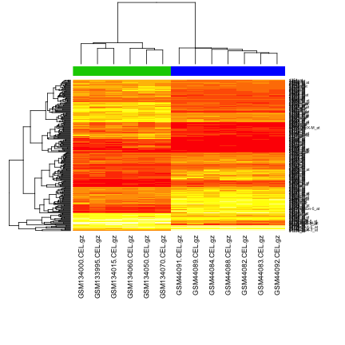
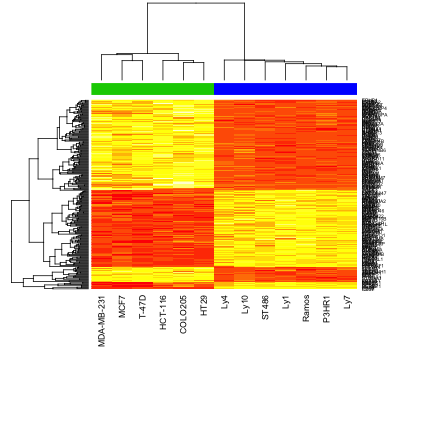

__Author: Nitesh Turaga, May 6th 2014__


Goal: from Affymetrix raw data stored in CEL files to differential gene expression
========================================================


### Some Basics

Getting  the working directory, in my case


```r
getwd()
```

```
[1] "/Users/niteshturaga/Documents/GeneExpressionDataAnalysis/affyData"
```


Setting the working directory, in my case:

```r
setwd("~/Documents/GeneExpressionDataAnalysis/affyData/")
```


Check the date


```r
date()
```

```
[1] "Thu May  8 21:09:23 2014"
```


Bioconductor
--------------


We are going to use the following packages from bioconductor:

1. affy 
2. limma 
3. hgu95a.db
4. annotate


### To install the missing packages from Bioconductor use biocLite()

First you need to get the list of available packages

```
Bioconductor version 2.13 (BiocInstaller 1.12.1), ?biocLite for help
A newer version of Bioconductor is available after installing a new
  version of R, ?BiocUpgrade for help
Loading required package: affy
Loading required package: BiocGenerics
Loading required package: parallel

Attaching package: 'BiocGenerics'

The following objects are masked from 'package:parallel':

    clusterApply, clusterApplyLB, clusterCall, clusterEvalQ,
    clusterExport, clusterMap, parApply, parCapply, parLapply,
    parLapplyLB, parRapply, parSapply, parSapplyLB

The following object is masked from 'package:stats':

    xtabs

The following objects are masked from 'package:base':

    anyDuplicated, append, as.data.frame, as.vector, cbind,
    colnames, duplicated, eval, evalq, Filter, Find, get,
    intersect, is.unsorted, lapply, Map, mapply, match, mget,
    order, paste, pmax, pmax.int, pmin, pmin.int, Position, rank,
    rbind, Reduce, rep.int, rownames, sapply, setdiff, sort,
    table, tapply, union, unique, unlist

Loading required package: Biobase
Welcome to Bioconductor

    Vignettes contain introductory material; view with
    'browseVignettes()'. To cite Bioconductor, see
    'citation("Biobase")', and for packages 'citation("pkgname")'.

Loading required package: limma

Attaching package: 'limma'

The following object is masked from 'package:BiocGenerics':

    plotMA

Loading required package: hgu95a.db
Loading required package: AnnotationDbi
Loading required package: org.Hs.eg.db
Loading required package: DBI


Loading required package: annotate
```


Clear the workspace, note the two "embedded" functions


```r
rm(list = ls())
```


### Load the libraries needed for the analysis, note the use of "require"

```r
require(affy)
require(limma)
require(hgu95a.db)
require(annotate)
```


Reading and preprocessing the expression data
------------------------------------------------

Load data from CEL files using the ReadAffy function

```r
dat <- ReadAffy(celfile.path = "./data/raw", compress = TRUE)
```


Let's have a look at the dat object, so just print. Remember that in R, you can just enter the name of the object
and it automatically prints.

```r
# print(dat) is the same as 'dat'.
dat
```

```
## 
```

```
## AffyBatch object
## size of arrays=640x640 features (20 kb)
## cdf=HG_U95A (12626 affyids)
## number of samples=13
## number of genes=12626
## annotation=hgu95a
## notes=
```


Check the **Class** of the dat object

```r
class(dat)
```

```
[1] "AffyBatch"
attr(,"package")
[1] "affy"
```


You can find information about this class as usual


Check the Dimensions of the object, the structure and information about the annotation of the data. It is important to know how the data is organized, and get some information from the **AffyBatch** class.

```r
# Dimensions
dim(dat)
```

```
Rows Cols 
 640  640 
```


```r
# Structure
str(dat)
```

```
Formal class 'AffyBatch' [package "affy"] with 10 slots
  ..@ cdfName          : chr "HG_U95A"
  ..@ nrow             : Named int 640
  .. ..- attr(*, "names")= chr "Rows"
  ..@ ncol             : Named int 640
  .. ..- attr(*, "names")= chr "Cols"
  ..@ assayData        :<environment: 0x7f960c5af240> 
  ..@ phenoData        :Formal class 'AnnotatedDataFrame' [package "Biobase"] with 4 slots
  .. .. ..@ varMetadata      :'data.frame':	1 obs. of  1 variable:
  .. .. .. ..$ labelDescription: chr "arbitrary numbering"
  .. .. ..@ data             :'data.frame':	13 obs. of  1 variable:
  .. .. .. ..$ sample: int [1:13] 1 2 3 4 5 6 7 8 9 10 ...
  .. .. ..@ dimLabels        : chr [1:2] "sampleNames" "sampleColumns"
  .. .. ..@ .__classVersion__:Formal class 'Versions' [package "Biobase"] with 1 slots
  .. .. .. .. ..@ .Data:List of 1
  .. .. .. .. .. ..$ : int [1:3] 1 1 0
  ..@ featureData      :Formal class 'AnnotatedDataFrame' [package "Biobase"] with 4 slots
  .. .. ..@ varMetadata      :'data.frame':	0 obs. of  1 variable:
  .. .. .. ..$ labelDescription: chr(0) 
  .. .. ..@ data             :'data.frame':	409600 obs. of  0 variables
  .. .. ..@ dimLabels        : chr [1:2] "featureNames" "featureColumns"
  .. .. ..@ .__classVersion__:Formal class 'Versions' [package "Biobase"] with 1 slots
  .. .. .. .. ..@ .Data:List of 1
  .. .. .. .. .. ..$ : int [1:3] 1 1 0
  ..@ experimentData   :Formal class 'MIAME' [package "Biobase"] with 13 slots
  .. .. ..@ name             : chr ""
  .. .. ..@ lab              : chr ""
  .. .. ..@ contact          : chr ""
  .. .. ..@ title            : chr ""
  .. .. ..@ abstract         : chr ""
  .. .. ..@ url              : chr ""
  .. .. ..@ pubMedIds        : chr ""
  .. .. ..@ samples          : list()
  .. .. ..@ hybridizations   : list()
  .. .. ..@ normControls     : list()
  .. .. ..@ preprocessing    :List of 2
  .. .. .. ..$ filenames  : chr [1:13] "./data/raw/GSM133995.CEL.gz" "./data/raw/GSM134000.CEL.gz" "./data/raw/GSM134015.CEL.gz" "./data/raw/GSM134050.CEL.gz" ...
  .. .. .. ..$ affyversion: chr NA
  .. .. ..@ other            :List of 1
  .. .. .. ..$ : chr ""
  .. .. ..@ .__classVersion__:Formal class 'Versions' [package "Biobase"] with 1 slots
  .. .. .. .. ..@ .Data:List of 2
  .. .. .. .. .. ..$ : int [1:3] 1 0 0
  .. .. .. .. .. ..$ : int [1:3] 1 1 0
  ..@ annotation       : chr "hgu95a"
  ..@ protocolData     :Formal class 'AnnotatedDataFrame' [package "Biobase"] with 4 slots
  .. .. ..@ varMetadata      :'data.frame':	1 obs. of  1 variable:
  .. .. .. ..$ labelDescription: chr NA
  .. .. ..@ data             :'data.frame':	13 obs. of  1 variable:
  .. .. .. ..$ ScanDate: chr [1:13] "07/13/ 11:25:32" "06/29/ 12:47:12" "06/29/ 12:26:42" "06/29/ 12:54:44" ...
  .. .. ..@ dimLabels        : chr [1:2] "sampleNames" "sampleColumns"
  .. .. ..@ .__classVersion__:Formal class 'Versions' [package "Biobase"] with 1 slots
  .. .. .. .. ..@ .Data:List of 1
  .. .. .. .. .. ..$ : int [1:3] 1 1 0
  ..@ .__classVersion__:Formal class 'Versions' [package "Biobase"] with 1 slots
  .. .. ..@ .Data:List of 4
  .. .. .. ..$ : int [1:3] 3 0 3
  .. .. .. ..$ : int [1:3] 2 22 0
  .. .. .. ..$ : int [1:3] 1 3 0
  .. .. .. ..$ : int [1:3] 1 2 0
```


```r
# Information about the platform
annotation(dat)
```

```
[1] "hgu95a"
```


```r
# Information about the features
head(featureData(dat))
```


```r
# Information about the samples, also called the phenotype data.
pData(dat)
```

```
                 sample
GSM133995.CEL.gz      1
GSM134000.CEL.gz      2
GSM134015.CEL.gz      3
GSM134050.CEL.gz      4
GSM134060.CEL.gz      5
GSM134070.CEL.gz      6
GSM44082.CEL.gz       7
GSM44083.CEL.gz       8
GSM44084.CEL.gz       9
GSM44088.CEL.gz      10
GSM44089.CEL.gz      11
GSM44091.CEL.gz      12
GSM44092.CEL.gz      13
```


Read the phenotype data associated with the experiment. __Note the use of colClasses__ in the following code.
colClasses, is setting each column to be read in with a specific data type. 

```r
pheno <- read.table("./data/targets.txt", sep = "\t", header = T, colClasses = c("character", 
    "character", "factor", "factor", "character"))
```


Let's have a look into the phenotypic information, and summarize some useful information.


```r
str(pheno)
```

```
'data.frame':	13 obs. of  5 variables:
 $ Name      : chr  "GSM133995.CEL.gz" "GSM134000.CEL.gz" "GSM134015.CEL.gz" "GSM134050.CEL.gz" ...
 $ CellLine  : chr  "MCF7" "MDA-MB-231" "T-47D" "COLO205" ...
 $ CancerType: Factor w/ 4 levels "breast","Burkitt",..: 1 1 1 3 3 3 2 2 2 4 ...
 $ CellType  : Factor w/ 2 levels "Epithelial","Lymphocytes": 1 1 1 1 1 1 2 2 2 2 ...
 $ Comment   : chr  "Breast cancer cell line" "Breast cancer cell line" "Breast cancer cell line" "Colon cancer cell line" ...
```

```r
# Let's get summarize the data
summary(pheno)
```

```
     Name             CellLine           CancerType        CellType
 Length:13          Length:13          breast :3    Epithelial :6  
 Class :character   Class :character   Burkitt:3    Lymphocytes:7  
 Mode  :character   Mode  :character   colon  :3                   
                                       DLBCL  :4                   
   Comment         
 Length:13         
 Class :character  
 Mode  :character  
                   
```

```r
# Factor are very useful!
table(pheno$CancerType, pheno$CellType)
```

```
         
          Epithelial Lymphocytes
  breast           3           0
  Burkitt          0           3
  colon            3           0
  DLBCL            0           4
```

```r

plot(pheno$CancerType, pheno$CellType)
```

 


We can add phenotypic information to the AffyBatch object

```r
if (all(rownames(pData(dat)) == pheno$Name)) {
    print("You're good, go ahead!")
    pheno <- merge(pData(dat), pheno, by.x = 0, by.y = "Name", sort = FALSE)
    rownames(pheno) <- pheno[, "Row.names"]
    pData(dat) <- pheno
} else {
    print("Check order of rows in pData(object) and pheno data provided!")
}
```

```
[1] "You're good, go ahead!"
```

```r

# Now pData(dat) is the merged object
pData(dat)
```

```
                        Row.names sample   CellLine CancerType    CellType
GSM133995.CEL.gz GSM133995.CEL.gz      1       MCF7     breast  Epithelial
GSM134000.CEL.gz GSM134000.CEL.gz      2 MDA-MB-231     breast  Epithelial
GSM134015.CEL.gz GSM134015.CEL.gz      3      T-47D     breast  Epithelial
GSM134050.CEL.gz GSM134050.CEL.gz      4    COLO205      colon  Epithelial
GSM134060.CEL.gz GSM134060.CEL.gz      5    HCT-116      colon  Epithelial
GSM134070.CEL.gz GSM134070.CEL.gz      6       HT29      colon  Epithelial
GSM44082.CEL.gz   GSM44082.CEL.gz      7      Ramos    Burkitt Lymphocytes
GSM44083.CEL.gz   GSM44083.CEL.gz      8      P3HR1    Burkitt Lymphocytes
GSM44084.CEL.gz   GSM44084.CEL.gz      9      ST486    Burkitt Lymphocytes
GSM44088.CEL.gz   GSM44088.CEL.gz     10        Ly1      DLBCL Lymphocytes
GSM44089.CEL.gz   GSM44089.CEL.gz     11       Ly10      DLBCL Lymphocytes
GSM44091.CEL.gz   GSM44091.CEL.gz     12        Ly4      DLBCL Lymphocytes
GSM44092.CEL.gz   GSM44092.CEL.gz     13        Ly7      DLBCL Lymphocytes
                                                 Comment
GSM133995.CEL.gz                 Breast cancer cell line
GSM134000.CEL.gz                 Breast cancer cell line
GSM134015.CEL.gz                 Breast cancer cell line
GSM134050.CEL.gz                  Colon cancer cell line
GSM134060.CEL.gz                  Colon cancer cell line
GSM134070.CEL.gz                  Colon cancer cell line
GSM44082.CEL.gz               Burkitt lymphoma cell line
GSM44083.CEL.gz               Burkitt lymphoma cell line
GSM44084.CEL.gz               Burkitt lymphoma cell line
GSM44088.CEL.gz  Diffuse large B cell lymphoma cell line
GSM44089.CEL.gz  Diffuse large B cell lymphoma cell line
GSM44091.CEL.gz  Diffuse large B cell lymphoma cell line
GSM44092.CEL.gz  Diffuse large B cell lymphoma cell line
```


Normalize
----------

We can now normalize the data, for instance the  **rma()** function, Alternatives you want to look into are **frma()** and **gcrma()**.

```r
dat.rma <- rma(dat)
```

```
Background correcting
Normalizing
Calculating Expression
```

```r

# Check the new object after normalization
class(dat.rma)
```

```
[1] "ExpressionSet"
attr(,"package")
[1] "Biobase"
```


Nevertheless the following methods still work, since **ExpressionSet is also derived from eSet, just like AffyBatch**. 

```r
pData(dat.rma)
annotation(dat.rma)
head(featureData(dat.rma))
dim(dat.rma)
```


Now we can save the two objects before going ahead


```r
save(dat, dat.rma, file = "./objs/affyData.rda")
```


Differential Gene Expression Analysis
==========================================

Design Matrix
-------------

To create the design matrix and to fit the linear model we start combining all levels of our factors of interest.

```r
groups <- factor(paste(pheno$CancerType, pheno$CellType, sep = "."))

# Count the number of sample per group
table(groups)
```

```
groups
  breast.Epithelial Burkitt.Lymphocytes    colon.Epithelial 
                  3                   3                   3 
  DLBCL.Lymphocytes 
                  4 
```

```r

# Create the design matrix
dMat <- model.matrix(~0 + groups)
colnames(dMat) <- levels(groups)

# This is the design matrix
dMat
```

```
   breast.Epithelial Burkitt.Lymphocytes colon.Epithelial
1                  1                   0                0
2                  1                   0                0
3                  1                   0                0
4                  0                   0                1
5                  0                   0                1
6                  0                   0                1
7                  0                   1                0
8                  0                   1                0
9                  0                   1                0
10                 0                   0                0
11                 0                   0                0
12                 0                   0                0
13                 0                   0                0
   DLBCL.Lymphocytes
1                  0
2                  0
3                  0
4                  0
5                  0
6                  0
7                  0
8                  0
9                  0
10                 1
11                 1
12                 1
13                 1
attr(,"assign")
[1] 1 1 1 1
attr(,"contrasts")
attr(,"contrasts")$groups
[1] "contr.treatment"
```

```r

# In reality we could just use the informations in the pheno$CancerType
# factor, which is equivalent
table(pheno$CancerType)
```

```

 breast Burkitt   colon   DLBCL 
      3       3       3       4 
```

```r
dMat2 <- model.matrix(~0 + pheno$CancerType)
colnames(dMat2) <- levels(pheno$CancerType)

# This is the second design matrix
dMat2
```

```
   breast Burkitt colon DLBCL
1       1       0     0     0
2       1       0     0     0
3       1       0     0     0
4       0       0     1     0
5       0       0     1     0
6       0       0     1     0
7       0       1     0     0
8       0       1     0     0
9       0       1     0     0
10      0       0     0     1
11      0       0     0     1
12      0       0     0     1
13      0       0     0     1
attr(,"assign")
[1] 1 1 1 1
attr(,"contrasts")
attr(,"contrasts")$`pheno$CancerType`
[1] "contr.treatment"
```

```r

# As you can see they are exactly the same
dMat == dMat2
```

```
   breast.Epithelial Burkitt.Lymphocytes colon.Epithelial
1               TRUE                TRUE             TRUE
2               TRUE                TRUE             TRUE
3               TRUE                TRUE             TRUE
4               TRUE                TRUE             TRUE
5               TRUE                TRUE             TRUE
6               TRUE                TRUE             TRUE
7               TRUE                TRUE             TRUE
8               TRUE                TRUE             TRUE
9               TRUE                TRUE             TRUE
10              TRUE                TRUE             TRUE
11              TRUE                TRUE             TRUE
12              TRUE                TRUE             TRUE
13              TRUE                TRUE             TRUE
   DLBCL.Lymphocytes
1               TRUE
2               TRUE
3               TRUE
4               TRUE
5               TRUE
6               TRUE
7               TRUE
8               TRUE
9               TRUE
10              TRUE
11              TRUE
12              TRUE
13              TRUE
```


Contrasts Matrix
------------------

Let's create now a contrast matrix to extract differences between coefficients.

A contrast matrix using the first design matrix

```r
cMat <- makeContrasts(levels = colnames(dMat), CellType = (((colon.Epithelial + 
    breast.Epithelial)/2) - ((Burkitt.Lymphocytes + DLBCL.Lymphocytes)/2)), 
    CancerType.Epithelial = (colon.Epithelial - breast.Epithelial), CancerType.Lyphocytes = (Burkitt.Lymphocytes - 
        DLBCL.Lymphocytes))

# All coefficients that were combined contribute equally. The columns sum
# must be equal to 0.
cMat
```

```
                     Contrasts
Levels                CellType CancerType.Epithelial CancerType.Lyphocytes
  breast.Epithelial        0.5                    -1                     0
  Burkitt.Lymphocytes     -0.5                     0                     1
  colon.Epithelial         0.5                     1                     0
  DLBCL.Lymphocytes       -0.5                     0                    -1
```

```r
apply(cMat, 2, sum)
```

```
             CellType CancerType.Epithelial CancerType.Lyphocytes 
                    0                     0                     0 
```

```r


# A contrast matrix using the second design matrix
cMat2 <- makeContrasts(levels = colnames(dMat2), CellType = (((colon + breast)/2) - 
    ((Burkitt + DLBCL)/2)), CancerType.Epithelial = (colon - breast), CancerType.Lyphocytes = (Burkitt - 
    DLBCL))

# Also in this case all the coefficients that were combined must contribute
# equally. The columns sum again must be equal to 0.
cMat2
```

```
         Contrasts
Levels    CellType CancerType.Epithelial CancerType.Lyphocytes
  breast       0.5                    -1                     0
  Burkitt     -0.5                     0                     1
  colon        0.5                     1                     0
  DLBCL       -0.5                     0                    -1
```

```r
apply(cMat2, 2, sum)
```

```
             CellType CancerType.Epithelial CancerType.Lyphocytes 
                    0                     0                     0 
```

```r

# The two contrasts matrices are the same
cMat == cMat2
```

```
                     Contrasts
Levels                CellType CancerType.Epithelial CancerType.Lyphocytes
  breast.Epithelial       TRUE                  TRUE                  TRUE
  Burkitt.Lymphocytes     TRUE                  TRUE                  TRUE
  colon.Epithelial        TRUE                  TRUE                  TRUE
  DLBCL.Lymphocytes       TRUE                  TRUE                  TRUE
```


Fit the model using the first design and contrast matrices
-----------------------------------------------------------

You might want to learn about __lmFit()__ and __contrasts.fit()__ 

```r
fit.ls <- lmFit(dat.rma, dMat, method = "ls")
fit.ls <- contrasts.fit(fit.ls, cMat)

# Fit the model using the second design matrix and contrast matrices
fit2.ls <- lmFit(dat.rma, dMat2, method = "ls")
fit2.ls <- contrasts.fit(fit2.ls, cMat2)

# Moderation of standard errors using empirical Bayes for first model fit
eb.ls <- eBayes(fit.ls, proportion = 0.01)
eb.ls
```

```
An object of class "MArrayLM"
$coefficients
           Contrasts
            CellType CancerType.Epithelial CancerType.Lyphocytes
  100_g_at    0.1742              0.009344               0.06397
  1000_at     0.5000             -0.029991               0.06890
  1001_at     0.2821             -0.246914              -0.10312
  1002_f_at   0.2566             -0.016300               0.05953
  1003_s_at  -0.4410             -0.177165              -0.84585
12621 more rows ...

$rank
[1] 4

$assign
[1] 1 1 1 1

$qr
$qr
  breast.Epithelial Burkitt.Lymphocytes colon.Epithelial DLBCL.Lymphocytes
1           -1.7321               0.000           0.0000                 0
2            0.5774              -1.732           0.0000                 0
3            0.5774               0.000          -1.7321                 0
4            0.0000               0.000           0.5774                -2
5            0.0000               0.000           0.5774                 0
8 more rows ...

$qraux
[1] 1.577 1.000 1.000 1.000

$pivot
[1] 1 2 3 4

$tol
[1] 1e-07

$rank
[1] 4


$df.residual
[1] 9 9 9 9 9
12621 more elements ...

$sigma
 100_g_at   1000_at   1001_at 1002_f_at 1003_s_at 
   0.1347    0.3553    0.2689    0.1391    0.4522 
12621 more elements ...

$cov.coefficients
                       Contrasts
Contrasts               CellType CancerType.Epithelial
  CellType               0.31250                0.0000
  CancerType.Epithelial  0.00000                0.6667
  CancerType.Lyphocytes -0.04167                0.0000
                       Contrasts
Contrasts               CancerType.Lyphocytes
  CellType                           -0.04167
  CancerType.Epithelial               0.00000
  CancerType.Lyphocytes               0.58333

$stdev.unscaled
           Contrasts
            CellType CancerType.Epithelial CancerType.Lyphocytes
  100_g_at     0.559                0.8165                0.7638
  1000_at      0.559                0.8165                0.7638
  1001_at      0.559                0.8165                0.7638
  1002_f_at    0.559                0.8165                0.7638
  1003_s_at    0.559                0.8165                0.7638
12621 more rows ...

$Amean
 100_g_at   1000_at   1001_at 1002_f_at 1003_s_at 
   10.522    10.214     7.033     6.675     9.106 
12621 more elements ...

$method
[1] "ls"

$design
  breast.Epithelial Burkitt.Lymphocytes colon.Epithelial DLBCL.Lymphocytes
1                 1                   0                0                 0
2                 1                   0                0                 0
3                 1                   0                0                 0
4                 0                   0                1                 0
5                 0                   0                1                 0
8 more rows ...

$contrasts
                     Contrasts
Levels                CellType CancerType.Epithelial CancerType.Lyphocytes
  breast.Epithelial        0.5                    -1                     0
  Burkitt.Lymphocytes     -0.5                     0                     1
  colon.Epithelial         0.5                     1                     0
  DLBCL.Lymphocytes       -0.5                     0                    -1

$df.prior
[1] 2.114

$s2.prior
[1] 0.05327

$var.prior
[1] 48.3376 11.9054  0.1877

$proportion
[1] 0.01

$s2.post
 100_g_at   1000_at   1001_at 1002_f_at 1003_s_at 
  0.02483   0.11238   0.06868   0.02581   0.17576 
12621 more elements ...

$t
           Contrasts
            CellType CancerType.Epithelial CancerType.Lyphocytes
  100_g_at     1.978               0.07262                0.5315
  1000_at      2.668              -0.10957                0.2691
  1001_at      1.926              -1.15390               -0.5152
  1002_f_at    2.857              -0.12427                0.4851
  1003_s_at   -1.882              -0.51757               -2.6417
12621 more rows ...

$df.total
[1] 11.11 11.11 11.11 11.11 11.11
12621 more elements ...

$p.value
           Contrasts
            CellType CancerType.Epithelial CancerType.Lyphocytes
  100_g_at   0.07328                0.9434               0.60553
  1000_at    0.02171                0.9147               0.79279
  1001_at    0.08012                0.2728               0.61650
  1002_f_at  0.01545                0.9033               0.63700
  1003_s_at  0.08628                0.6149               0.02275
12621 more rows ...

$lods
           Contrasts
            CellType CancerType.Epithelial CancerType.Lyphocytes
  100_g_at    -5.306                -6.061                -4.698
  1000_at     -4.146                -6.057                -4.725
  1001_at     -5.388                -5.417                -4.700
  1002_f_at   -3.812                -6.056                -4.704
  1003_s_at   -5.456                -5.927                -4.137
12621 more rows ...

$F
[1] 1.482 2.471 1.716 2.923 3.956
12621 more elements ...

$F.p.value
[1] 0.27268 0.11583 0.22071 0.08101 0.03837
12621 more elements ...
```

```r

# Moderation of standard errors using empirical Bayes for second model fit
eb2.ls <- eBayes(fit2.ls, proportion = 0.01)
```


**Save the model**

With the following you can write the complete linear model analysis results to a file in a tabular format

```r
write.fit(eb.ls, file = "./text/anovaTable.txt")
```


You can retrieve the top differentially expressed genes for a specific contrast in the contrast matrix by name

```r
tG <- topTable(eb.ls, coef = "CellType", number = 10, resort = "logFC", genelist = rownames(eb.ls))
tG
```

```
                           ID  logFC AveExpr      t   P.Value adj.P.Val
AFFX-BioB-3_at AFFX-BioB-3_at  5.003  11.554  25.28 3.568e-11 6.435e-08
AFFX-BioB-M_at AFFX-BioB-M_at  4.390  11.822  20.66 3.222e-10 3.954e-07
426_at                 426_at  3.825   7.132  31.58 3.108e-12 7.847e-09
39712_at             39712_at  2.773   9.438  22.42 1.320e-10 1.851e-07
34771_at             34771_at  1.715   9.737  24.18 5.805e-11 9.162e-08
1864_at               1864_at -3.317   7.166 -25.70 2.972e-11 6.254e-08
AFFX-CreX-3_at AFFX-CreX-3_at -3.957  12.661 -36.58 6.154e-13 2.590e-09
41165_g_at         41165_g_at -4.395  12.664 -34.05 1.356e-12 4.281e-09
41164_at             41164_at -4.977  12.338 -42.54 1.162e-13 7.337e-10
125_r_at             125_r_at -5.052  10.466 -50.66 1.681e-14 2.122e-10
                   B
AFFX-BioB-3_at 15.62
AFFX-BioB-M_at 13.80
426_at         17.43
39712_at       14.56
34771_at       15.23
1864_at        15.77
AFFX-CreX-3_at 18.48
41165_g_at     17.98
41164_at       19.43
125_r_at       20.36
```

```r
tG <- tG[order(tG$ID), ]
# tG <- tG[order(rownames(tG)),]
```


You can retrieve the top differentially expressed genes for a specific contrast in the contrast matrix by index

```r
tG2 <- topTable(eb2.ls, coef = 1, number = 10, resort = "logFC", genelist = rownames(eb2.ls))
tG2
```

```
                           ID  logFC AveExpr      t   P.Value adj.P.Val
AFFX-BioB-3_at AFFX-BioB-3_at  5.003  11.554  25.28 3.568e-11 6.435e-08
AFFX-BioB-M_at AFFX-BioB-M_at  4.390  11.822  20.66 3.222e-10 3.954e-07
426_at                 426_at  3.825   7.132  31.58 3.108e-12 7.847e-09
39712_at             39712_at  2.773   9.438  22.42 1.320e-10 1.851e-07
34771_at             34771_at  1.715   9.737  24.18 5.805e-11 9.162e-08
1864_at               1864_at -3.317   7.166 -25.70 2.972e-11 6.254e-08
AFFX-CreX-3_at AFFX-CreX-3_at -3.957  12.661 -36.58 6.154e-13 2.590e-09
41165_g_at         41165_g_at -4.395  12.664 -34.05 1.356e-12 4.281e-09
41164_at             41164_at -4.977  12.338 -42.54 1.162e-13 7.337e-10
125_r_at             125_r_at -5.052  10.466 -50.66 1.681e-14 2.122e-10
                   B
AFFX-BioB-3_at 15.62
AFFX-BioB-M_at 13.80
426_at         17.43
39712_at       14.56
34771_at       15.23
1864_at        15.77
AFFX-CreX-3_at 18.48
41165_g_at     17.98
41164_at       19.43
125_r_at       20.36
```

```r
tG2 <- tG2[order(tG2$ID), ]
# tG2 <- tG2[order(rownames(tG2)),]
```


The same genes were identified

```r
all(tG == tG2)
```

```
[1] TRUE
```

```r

# We can also return ALL the features investigated by using Inf
tG2 <- topTable(eb2.ls, coef = 1, number = Inf, resort = "logFC", genelist = rownames(eb2.ls))

# As you can see we need to add gene annotation!
str(tG2)
```

```
'data.frame':	12626 obs. of  7 variables:
 $ ID       : chr  "35766_at" "40899_at" "AFFX-BioB-3_at" "31888_s_at" ...
 $ logFC    : num  7.08 5.73 5 4.97 4.56 ...
 $ AveExpr  : num  10.32 9.89 11.55 9.18 10.5 ...
 $ t        : num  20.53 11.94 25.28 16.24 7.45 ...
 $ P.Value  : num  3.45e-10 1.10e-07 3.57e-11 4.30e-09 1.21e-05 ...
 $ adj.P.Val: num  3.95e-07 2.73e-05 6.43e-08 2.49e-06 6.97e-04 ...
 $ B        : num  13.74 8.32 15.62 11.46 3.53 ...
```


Retrieve and add the annotation
-------------------------

Retrieve and add gene SYMBOLS, ENTREZID, and GENENAME

Using the "old" hard-way method based on mget():

```r
# Get ENTREZID
egid <- mget(tG2$ID, hgu95aENTREZID, ifnotfound = NA)

# Get Gene Symbol
sym <- mget(tG2$ID, hgu95aSYMBOL, ifnotfound = NA)

# Get Gene Name
nm <- mget(tG2$ID, hgu95aGENENAME, ifnotfound = NA)
```


Add the annnotation to differential gene expression results

```r
tG2ann <- cbind(EGID = unlist(egid), SYMBOL = unlist(sym), GeneName = unlist(nm), 
    tG2, stringsAsFactors = FALSE)
```


Let's check the results now

Print and see what the what the data frame looks like after adding the annotation.

```r
tG2ann

str(tG2ann)
```


### Retrieve and add gene SYMBOLS, ENTREZID, and GENENAME

Using the "new" and simple method based on select():


```r
### Alternative ### ann <- select(x=hgu95a.db,
### keys=rownames(tG2),cols=c('ENTREZID', 'SYMBOL', 'GENENAME'))

ann <- select(x = hgu95a.db, keys = tG2$ID, columns = c("ENTREZID", "SYMBOL", 
    "GENENAME"))
```

```
Warning: 'select' resulted in 1:many mapping between keys and return rows
```

```r

# Check the dimensions of the annotation the results data.frames
dim(ann)
```

```
[1] 13830     4
```

```r
dim(tG2)
```

```
[1] 12626     7
```


Add the annnotation to differential gene expression results


```r
# tG2$ID = rownames(tG2)
tG2ann2 <- merge(x = ann, y = tG2, by.x = "PROBEID", by.y = "ID", all.x = TRUE, 
    all.y = FALSE)

### Let's check the results now
str(tG2ann2)
```

```
'data.frame':	13830 obs. of  10 variables:
 $ PROBEID  : chr  "100_g_at" "1000_at" "1001_at" "1002_f_at" ...
 $ ENTREZID : chr  "5875" "5595" "7075" "1557" ...
 $ SYMBOL   : chr  "RABGGTA" "MAPK3" "TIE1" "CYP2C19" ...
 $ GENENAME : chr  "Rab geranylgeranyltransferase, alpha subunit" "mitogen-activated protein kinase 3" "tyrosine kinase with immunoglobulin-like and EGF-like domains 1" "cytochrome P450, family 2, subfamily C, polypeptide 19" ...
 $ logFC    : num  0.174 0.5 0.282 0.257 -0.441 ...
 $ AveExpr  : num  10.52 10.21 7.03 6.67 9.11 ...
 $ t        : num  1.98 2.67 1.93 2.86 -1.88 ...
 $ P.Value  : num  0.0733 0.0217 0.0801 0.0155 0.0863 ...
 $ adj.P.Val: num  0.176 0.0789 0.1872 0.0631 0.1972 ...
 $ B        : num  -5.31 -4.15 -5.39 -3.81 -5.46 ...
```


We can save the results as usual for later use

```r
save(tG2, fit2.ls, eb2.ls, dMat2, cMat2, file = "./objs/linearModel.rda")
```


We can also filter the genes and create a report page

```r
# tmp <- tG2[ tG2$B > 10 , ]
tmp <- tG2ann2[tG2ann2$adj.P.Val < 0.001, ]


### Reorder the columns to have ENTREZID as the first column: hyperlinks to
### the NCBI ENTREZ GENE database will be generated
tmp <- tmp[, c(2, 1, 3:ncol(tmp))]
```


Write the results to an html file

```r

htmlpage(as.data.frame(tmp[, 1]), filename = "./html/result.html", othernames = as.data.frame(tmp[, 
    2:ncol(tmp)]), table.head = colnames(tmp), digits = 4)
```


A few useful plots
--------------------


We can make a **volcano plot**


```r
volcanoplot(eb2.ls)
```

 


We can Retrieve the original gene expression for the interesting genes

All the expression values

```r
mat <- exprs(dat.rma)
dim(mat)
```

```
[1] 12626    13
```

```r

# Filter to the interesting ones (differentially expressed genes)
mat <- mat[rownames(mat) %in% tmp$PROBEID, ]
dim(mat)
```

```
[1] 259  13
```


Generate a **heatmap()**

```r
heatmap(mat, scale = "none", na.rm = TRUE, margins = c(15, 7), distfun = function(x) {
    dist(x, method = "euclidian")
}, hclustfun = function(x) {
    hclust(x, method = "average")
}, ColSideColors = as.character(2 + as.numeric(pheno$CellType)))
```

 

```r


# Add symbol as rownames using mget()
colnames(mat) <- pheno$CellLine
mySym <- mget(rownames(mat), hgu95aSYMBOL, ifnotfound = NA)
rownames(mat) <- unlist(mySym)


# Generated the annotated heatmap with heatmap()
heatmap(mat, scale = "row", na.rm = TRUE, margins = c(15, 7), distfun = function(x) {
    dist(x, method = "euclidian")
}, hclustfun = function(x) {
    hclust(x, method = "average")
}, ColSideColors = as.character(2 + as.numeric(pheno$CellType)))
```

 


### Session information

This is always important for debugging and posting on forums if required. 


```r
sessionInfo()
```

```
R version 3.0.3 (2014-03-06)
Platform: x86_64-apple-darwin13.1.0 (64-bit)

locale:
[1] en_US.UTF-8/en_US.UTF-8/en_US.UTF-8/C/en_US.UTF-8/en_US.UTF-8

attached base packages:
[1] parallel  stats     graphics  grDevices utils     datasets  methods  
[8] base     

other attached packages:
 [1] hgu95acdf_2.13.0     annotate_1.40.1      hgu95a.db_2.10.1    
 [4] org.Hs.eg.db_2.10.1  RSQLite_0.11.4       DBI_0.2-7           
 [7] AnnotationDbi_1.24.0 limma_3.18.13        affy_1.40.0         
[10] Biobase_2.22.0       BiocGenerics_0.8.0   BiocInstaller_1.12.1
[13] knitr_1.5           

loaded via a namespace (and not attached):
 [1] affyio_1.30.0         codetools_0.2-8       digest_0.6.4         
 [4] evaluate_0.5.5        formatR_0.10          IRanges_1.20.7       
 [7] preprocessCore_1.24.0 stats4_3.0.3          stringr_0.6.2        
[10] tools_3.0.3           XML_3.98-1.1          xtable_1.7-3         
[13] zlibbioc_1.8.0       
```

