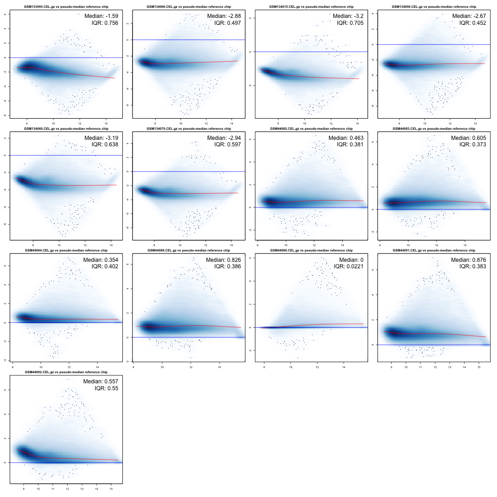
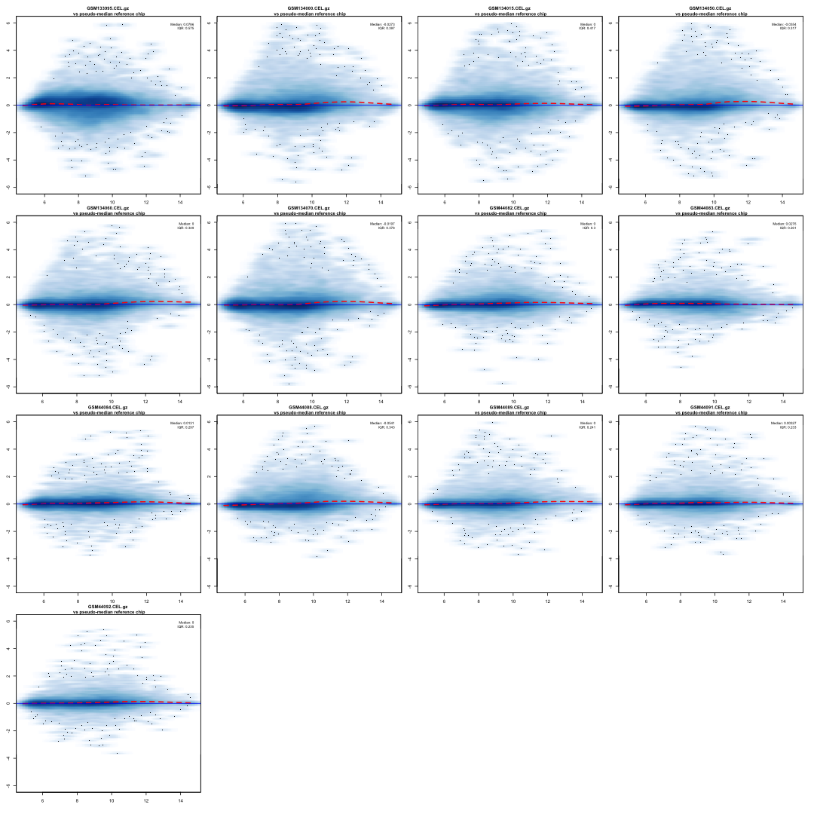

__Author: Nitesh Turaga, May 6th 2014__


Goal: from Affymetrix raw data stored in CEL files to differential gene expression
========================================================


### Some Basics

Getting  the working directory, in my case


```r
getwd()
```

```
[1] "/Users/niteshturaga/Documents/GeneExpressionDataAnalysis/affyData"
```


Setting the working directory, in my case:

```r
setwd("~/Documents/GeneExpressionDataAnalysis/affyData/")
```


Check the date


```r
date()
```

```
[1] "Tue May  6 06:46:20 2014"
```


Clear the workspace, note the two "embedded" functions

```r
rm(list = ls())
```


Load the libraries needed for the analysis, note the use of "require"

```r
require(affy)
```

```
Loading required package: affy
Loading required package: BiocGenerics
Loading required package: parallel

Attaching package: 'BiocGenerics'

The following objects are masked from 'package:parallel':

    clusterApply, clusterApplyLB, clusterCall, clusterEvalQ,
    clusterExport, clusterMap, parApply, parCapply, parLapply,
    parLapplyLB, parRapply, parSapply, parSapplyLB

The following object is masked from 'package:stats':

    xtabs

The following objects are masked from 'package:base':

    anyDuplicated, append, as.data.frame, as.vector, cbind,
    colnames, duplicated, eval, evalq, Filter, Find, get,
    intersect, is.unsorted, lapply, Map, mapply, match, mget,
    order, paste, pmax, pmax.int, pmin, pmin.int, Position, rank,
    rbind, Reduce, rep.int, rownames, sapply, setdiff, sort,
    table, tapply, union, unique, unlist

Loading required package: Biobase
Welcome to Bioconductor

    Vignettes contain introductory material; view with
    'browseVignettes()'. To cite Bioconductor, see
    'citation("Biobase")', and for packages 'citation("pkgname")'.
```

```r
require(hgu95a.db)
```

```
Loading required package: hgu95a.db
Loading required package: AnnotationDbi
Loading required package: org.Hs.eg.db
Loading required package: DBI
```


### Load data previously saved, and check their classes


```r
load("./objs/affyData.rda")
```


Check the the workspace content

```r
ls()
```

```
## [1] "dat"     "dat.rma"
```


Check classes

```r
class(dat)
```

```
[1] "AffyBatch"
attr(,"package")
[1] "affy"
```

```r

### Note: dat.rma is an ExpresssionSet, which is a
class(dat.rma)
```

```
[1] "ExpressionSet"
attr(,"package")
[1] "Biobase"
```


Access to data in the class
---------------------------

Slots/elements contained in the two classes can be seen using:
__NOTE: SLOT NAMES USUALLY WORK AS ACCESSORS__

```r
slotNames(dat)
```

```
 [1] "cdfName"           "nrow"              "ncol"             
 [4] "assayData"         "phenoData"         "featureData"      
 [7] "experimentData"    "annotation"        "protocolData"     
[10] ".__classVersion__"
```

```r
slotNames(dat.rma)
```

```
[1] "experimentData"    "assayData"         "phenoData"        
[4] "featureData"       "annotation"        "protocolData"     
[7] ".__classVersion__"
```


The **exprs** extracts normalized and summarized gene expression

```r
dat.expr <- exprs(dat.rma)
dim(dat.expr)
```

```
[1] 12626    13
```


The **pData** function extracts the phenotypic information

```r
pData(dat.rma)
```

```
                        Row.names sample   CellLine CancerType    CellType
GSM133995.CEL.gz GSM133995.CEL.gz      1       MCF7     breast  Epithelial
GSM134000.CEL.gz GSM134000.CEL.gz      2 MDA-MB-231     breast  Epithelial
GSM134015.CEL.gz GSM134015.CEL.gz      3      T-47D     breast  Epithelial
GSM134050.CEL.gz GSM134050.CEL.gz      4    COLO205      colon  Epithelial
GSM134060.CEL.gz GSM134060.CEL.gz      5    HCT-116      colon  Epithelial
GSM134070.CEL.gz GSM134070.CEL.gz      6       HT29      colon  Epithelial
GSM44082.CEL.gz   GSM44082.CEL.gz      7      Ramos    Burkitt Lymphocytes
GSM44083.CEL.gz   GSM44083.CEL.gz      8      P3HR1    Burkitt Lymphocytes
GSM44084.CEL.gz   GSM44084.CEL.gz      9      ST486    Burkitt Lymphocytes
GSM44088.CEL.gz   GSM44088.CEL.gz     10        Ly1      DLBCL Lymphocytes
GSM44089.CEL.gz   GSM44089.CEL.gz     11       Ly10      DLBCL Lymphocytes
GSM44091.CEL.gz   GSM44091.CEL.gz     12        Ly4      DLBCL Lymphocytes
GSM44092.CEL.gz   GSM44092.CEL.gz     13        Ly7      DLBCL Lymphocytes
                                                 Comment
GSM133995.CEL.gz                 Breast cancer cell line
GSM134000.CEL.gz                 Breast cancer cell line
GSM134015.CEL.gz                 Breast cancer cell line
GSM134050.CEL.gz                  Colon cancer cell line
GSM134060.CEL.gz                  Colon cancer cell line
GSM134070.CEL.gz                  Colon cancer cell line
GSM44082.CEL.gz               Burkitt lymphoma cell line
GSM44083.CEL.gz               Burkitt lymphoma cell line
GSM44084.CEL.gz               Burkitt lymphoma cell line
GSM44088.CEL.gz  Diffuse large B cell lymphoma cell line
GSM44089.CEL.gz  Diffuse large B cell lymphoma cell line
GSM44091.CEL.gz  Diffuse large B cell lymphoma cell line
GSM44092.CEL.gz  Diffuse large B cell lymphoma cell line
```

The **annotation** function extracts features information

```r
annotation(dat.rma)
```

```
[1] "hgu95a"
```


The **pm** function extracts perfect match probe intensities.
_Perfect match probes are intended to match perfectly the target sequence_.

```r
dat.pm <- pm(dat)
```

```

```

```r
dim(dat.pm)
```

```
[1] 201807     13
```


The **mm** extract mismatch probe intensities
_Mismatch probes having one base mismatch with the target sequence intended to account for non-specific binding_

```r
dat.mm <- mm(dat)
dim(dat.mm)
```

```
[1] 201807     13
```


MA Plot 
---------

$M = log_{2}(R/G) = log_{2}(R) - log_{2}(G)$

$A = \frac{1}{2}log_{2}(R*G) = \frac{1}{2}(log_{2}(R) + log_{2}(G))$

### We can now make an MA-plot

We first define a function to divide the plotting area in rows and columns, 
if you are unfamiliar with how to set the plotting area, you can use the **?par**.

```r
mypar <- function(nRow = 1, nCol = 1, ptsExp = 1) {
    par(mar = c(2, 2, 2, 1))
    par(oma = c(2, 1, 1, 1))
    par(mfrow = c(nRow, nCol))
    par(cex = ptsExp)
}
```


We can compute rows and columns number based on the nuber of samples.
You can do this also manually:

```r
nc <- ceiling(sqrt(ncol(dat.rma)))
nr <- ceiling(ncol(dat.rma)/nc)
```


We can make a plot for the raw data, before normalization

```r
mypar(nr, nc, 0.5)
MAplot(dat[, ], pairs = F, plot.method = "smoothScatter")
```

```
KernSmooth 2.23 loaded
Copyright M. P. Wand 1997-2009
```

 


We can save the plot to a file,

```r
bitmap(file = "./figs/MApl.raw.png", width = 20, height = 10, res = 400)
mypar(nr, nc, 0.5)
par(oma = c(2, 1, 1, 1))
MAplot(dat[, ], pairs = F, plot.method = "smoothScatter")
dev.off()
```

```
pdf 
  2 
```


### MA-plot after normalization

```r
mypar(nr, nc, 0.5)
par(oma = c(2, 1, 1, 1))
a <- exprs(dat.rma)
for (i in 1:ncol(a)) {
    ma.plot(A = ((a[, i] + apply(a, 1, median))/2), M = (a[, i] - apply(a, 1, 
        median)), show.statistics = TRUE, cex.main = 1, span = 1/3, family.loess = "gaussian", 
        cex = 0.75, plot.method = "smoothScatter", add.loess = TRUE, lwd = 2, 
        lty = 2, loess.col = "red", ylim = c(-6, 6), main = paste(colnames(a)[i], 
            "\n vs pseudo-median reference chip"))
}
```

 


MA-plot after normalization: saved to a file

```r
bitmap(file = "./figs/MApl.rma.png", width = 20, height = 10, res = 400)
mypar(nr, nc, 0.5)
par(oma = c(2, 1, 1, 1))
a <- exprs(dat.rma)
for (i in 1:ncol(a)) {
    ma.plot(A = ((a[, i] + apply(a, 1, median))/2), M = (a[, i] - apply(a, 1, 
        median)), show.statistics = TRUE, cex.main = 1, span = 1/3, family.loess = "gaussian", 
        cex = 0.75, plot.method = "smoothScatter", add.loess = TRUE, lwd = 2, 
        lty = 2, loess.col = "red", ylim = c(-6, 6), main = paste(colnames(a)[i], 
            "vs pseudo-median reference chip"))
}
dev.off()
```

```
pdf 
  2 
```


### Diagnostic Plots: 2D-Image


```r
bitmap(file = "./figs/ima2D.png", width = 2 * nr, height = 2 * nc, res = 144)
mypar(nr, nc, 1)
par(mar = c(1, 1, 1, 1))
image(dat[, ])
dev.off()
```

```
pdf 
  2 
```


### Log2 intensities boxplots: before and after normalization

```r
bitmap(file = "./figs/exprBoxplot.png", width = 15, height = 15, res = 144)
mypar(2, 1, 0.75)
par(mar = c(10, 1, 1, 1))
### Before
boxplot(log2(exprs(dat)) ~ col(exprs(dat)), names = pData(dat.rma)[, "Row.names"], 
    las = 2, col = "blue")
### After
boxplot(exprs(dat.rma) ~ col(exprs(dat.rma)), names = pData(dat.rma)[, "Row.names"], 
    las = 2, col = "blue")
### Close the device
dev.off()
```

```
pdf 
  2 
```


### RNA Degradation

Compute RNA degradation

```r
deg <- AffyRNAdeg(dat)
```


Make RNA degradation plot

```r
bitmap(file = "./figs/degRNA.png", width = 5, height = 5, res = 1000)
mypar(2, 2, 0.75)
plotAffyRNAdeg(deg, cols = c(1:ncol(dat.rma)))
plot(density(deg$slope), main = "Slope")
boxplot(deg$slope, main = "Slope")
### Close the device
dev.off()
```

```
pdf 
  2 
```


Find the scan date

```r
dateOfScan <- protocolData(dat.rma)@data$ScanDate
# Don't need the time, so we will remove that using regular expressions
dateOfScan <- gsub(" .+", "", dateOfScan)
boxplot(log2(exprs(dat)), col = 1 + as.numeric(dateOfScan))
```

```
Warning: NAs introduced by coercion
```

 


### Session information

```r
sessionInfo()
```

```
R version 3.0.3 (2014-03-06)
Platform: x86_64-apple-darwin13.1.0 (64-bit)

locale:
[1] en_US.UTF-8/en_US.UTF-8/en_US.UTF-8/C/en_US.UTF-8/en_US.UTF-8

attached base packages:
[1] parallel  stats     graphics  grDevices utils     datasets  methods  
[8] base     

other attached packages:
 [1] hgu95acdf_2.13.0     hgu95a.db_2.10.1     org.Hs.eg.db_2.10.1 
 [4] RSQLite_0.11.4       DBI_0.2-7            AnnotationDbi_1.24.0
 [7] affy_1.40.0          Biobase_2.22.0       BiocGenerics_0.8.0  
[10] knitr_1.5           

loaded via a namespace (and not attached):
 [1] affyio_1.30.0         BiocInstaller_1.12.1  evaluate_0.5.5       
 [4] formatR_0.10          IRanges_1.20.7        KernSmooth_2.23-12   
 [7] preprocessCore_1.24.0 stats4_3.0.3          stringr_0.6.2        
[10] tools_3.0.3           zlibbioc_1.8.0       
```

